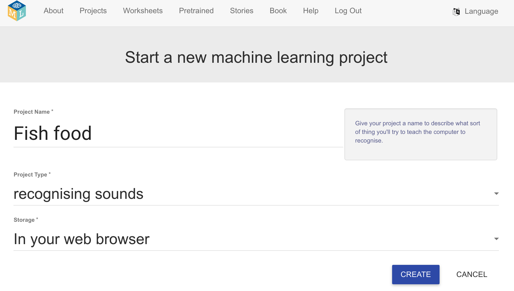
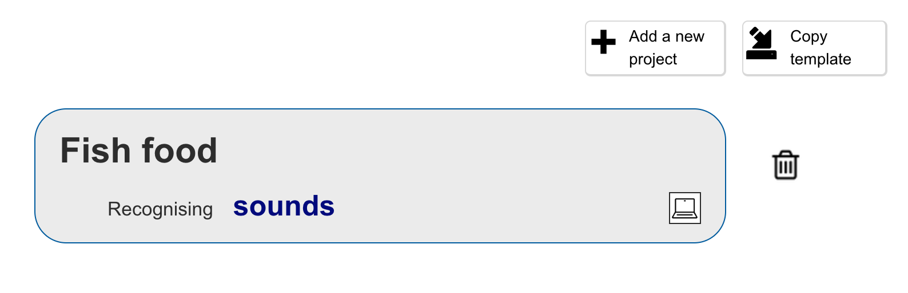
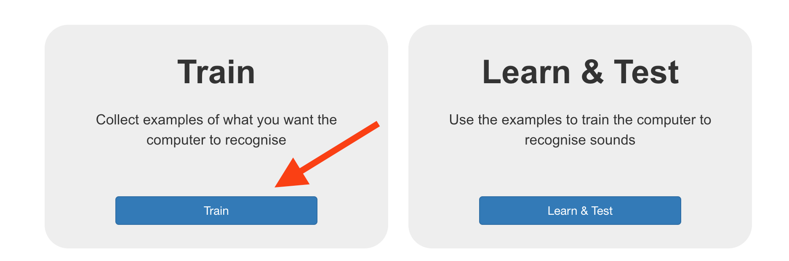

## Projekt einrichten

<html>

<iframe style="position: absolute; top: 0; left: 0; right: 0; width: 100%; height: 100%; border: none;" src="https://www.youtube.com/embed/K7g-nLoMBTA?rel=0&cc_load_policy=1" width="560" height="315" allowfullscreen allow="accelerometer; autoplay; clipboard-write; encrypted-media; gyroscope; picture-in-picture; web-share"></iframe>

</html>

\--- task ---

Gehe zu [machinelearningforkids.co.uk](https://machinelearningforkids.co.uk/#!/login){:target="_blank"} in einem Webbrowser.

Klicke auf **Jetzt ausprobieren**.

\--- /task ---

\--- task ---

Klicke in der Menüleiste oben auf **Projekte**.

Klicke auf den Knopf **+ Neues Projekt hinzufügen**.

Benenne dein Projekt `Fischfutter` und lernen Sie **Sounds** zu erkennen und speichern Sie die Daten **in Ihrem Webbrowser**. Dann klicke auf **Erstellen**.

In der Projektliste solltest du jetzt "Fisch Futter" sehen. Klicke auf das Projekt.

\--- /task ---

\--- task ---

Klicke auf den **Trainieren** Button.

Wenn du eine Pop-Up-Nachricht siehst, die dich fragt ein Mikrofon zu verwenden, klicke auf **Erlaube bei jedem Besuch**.

\--- /task ---

