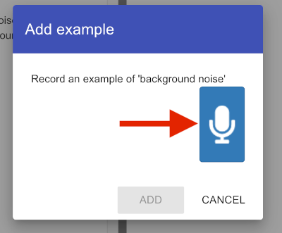

## Hintergrundgeräusche

<html>

<iframe style="position: absolute; top: 0; left: 0; right: 0; width: 100%; height: 100%; border: none;" src="https://www.youtube.com/embed/QQ7tSOlbyaY?rel=0&cc_load_policy=1" width="560" height="315" allowfullscreen allow="accelerometer; autoplay; clipboard-write; encrypted-media; gyroscope; picture-in-picture; web-share"></iframe>

</html>

Zuerst sammle Beispiele von Hintergrundgeräuschen. Das hilft deinem maschinellen Lernmodell, zwischen Ihren Sprachbefehlen und den Hintergrundgeräuschen an deinem Standort zu unterscheiden.

\--- task ---

Klicke den **+ Beispiele hinzufügen** Knopf in **Hintergrundgeräusche**.

Klicke auf das Mikrofon, aber spreche nicht, um 2 Sekunden Hintergrundgeräusche aufzunehmen.

Klicke auf **Hinzufügen** um deine Aufnahme zu speichern.

\--- /task ---

\--- task ---

Wiederhole diese Schritte, bis du **mindestens 8 Beispiele** von Hintergrundgeräuschen hast.

\--- /task ---
