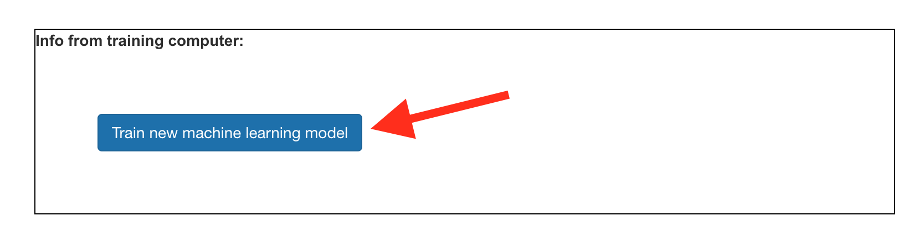

## Modell trainieren

<html>

<iframe style="position: absolute; top: 0; left: 0; right: 0; width: 100%; height: 100%; border: none;" src="https://www.youtube.com/embed/7UVZ5Mqp1iY?rel=0&cc_load_policy=1" width="560" height="315" allowfullscreen allow="accelerometer; autoplay; clipboard-write; encrypted-media; gyroscope; picture-in-picture; web-share"></iframe>

</html>

Du hast jetzt genügend Beispiele gesammelt, um mit diesen nun dein maschinelles Lernmodell zu trainieren.

\--- task ---

Klicke auf **< Zurück zum Projekt** in der oberen linken Ecke.

Klicke auf **Lernen & Testen**.

Klicke auf den Knopf **Neues maschinelles Lernmodell trainieren**. Dies kann einige Minuten dauern.

\--- /task ---

Sobald das Training beendet ist, kannst du testen, wie gut dein Modell deine Sprachbefehle erkennt.

\--- task ---

Klicke auf den **Starte Zuhören** Knopf und sage dann "Links".

\--- /task ---

Wenn dein maschinelles Lernmodell dies erkennt, wird angezeigt, was es denkt, dass du gesagt hast.

\--- task ---

Teste, ob das Modell auch "hoch", "runter" und "rechts" erkennt.

\--- /task ---

Wenn du nicht zufrieden bist wie dein Modell funktioniert, gehe zurück auf die **Trainieren** Seite und füge weitere Beispiele hinzu, dann trainiere dein Modell erneut.

