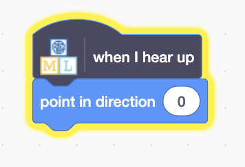

## Bewege den Fisch

<html>

<iframe style="position: absolute; top: 0; left: 0; right: 0; width: 100%; height: 100%; border: none;" src="https://www.youtube.com/embed/Gy54IjEGRTY?rel=0&cc_load_policy=1" width="560" height="315" allowfullscreen allow="accelerometer; autoplay; clipboard-write; encrypted-media; gyroscope; picture-in-picture; web-share"></iframe>

</html>

Weil dein Modell nun zwischen Wörtern unterscheiden kann, kannst du es in einem Scratch-Programm verwenden, um einen Fisch auf dem Bildschirm umher zubewegen.

\--- task ---

Klicke auf den **< Zurück zum Projekt** Link.

Klicke auf **Erstellen**.

Klicke auf **Scratch 3**.

Klicke auf **Öffne in Scratch 3**.

\--- /task ---

\--- task ---

Klicke auf **Projektvorlagen** oben und wähle das Projekt 'Fisch Futter', um eine Fischsprite zu laden, das bereits Code beinhaltet.

\--- /task ---

Machine Learning for Kids hat in Scratch schon einige bestimmte Blöcke hinzugefügt, mit denen du dein Modell trainieren kannst. Finde sie am unteren Rand der Blockliste.

![Eine Liste neuer Blöcke, die von Machine Learning for Kids erstellt wurden, inklusive Anweisungen wie 'Starte zuhören', 'Stoppe zuhören' und 'Wenn ich links höre'. (images/new-blocks.png)

\--- task ---

Wenn die **Fisch** Sprite ausgewählt ist, klicke auf das Tab **Code**. Finde die richtige Stelle im Code und füge einen bestimmten Block hinzu, um dem Modell zu sagen, dass es mit dem Zuhören beginnen soll.

![In der Fischsprite wird nach dem "Wenn die Flagge angeklickt wird"-Baustein ein 'Starte Zuhören'-Baustein hinzugefügt. (images/start-listening.png)

\--- /task ---

\--- task ---

Füge den Code für 'hoch' zu der **Fisch** Sprite hinzu.

\--- /task ---

\--- task ---

Schaue dir den Code an, um den Fisch nach oben zu bewegen, dann probiere den Code zu schreiben für unten, links und rechts.

## --- collapse ---

## title: Zeige mir wie

![Drei weitere Blöcke werden hinzugefügt: 'Wenn ich links höre' und 'Zeige in Richtung -90'; "Wenn ich rechts höre" und "Zeige in Richtung 90"; "Wenn ich unten höre" und "Zeige in Richtung 180". (images/finished-code.png)

\--- /collapse ---

\--- /task ---

\--- task ---

Klicke auf die **grüne Flagge** und sage, hoch, runter, links, oder rechts. Überprüfe, ob sich der Fisch in die von dir erwartete Richtung bewegt.

\--- /task ---

