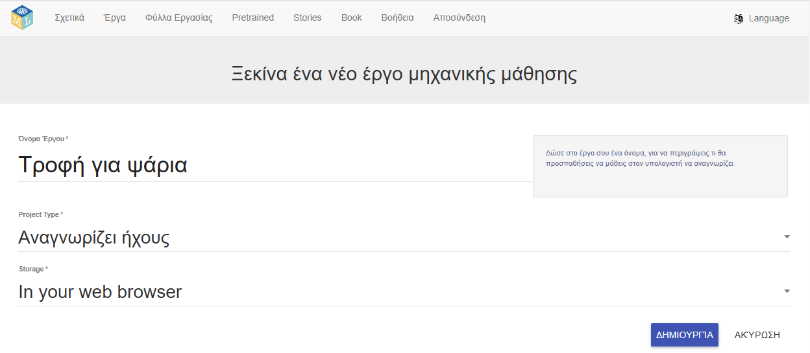
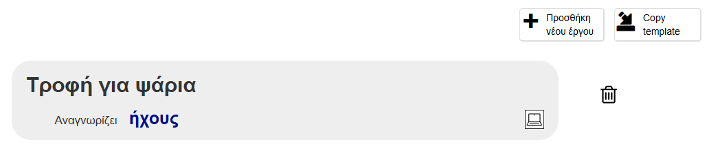
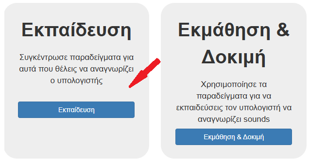
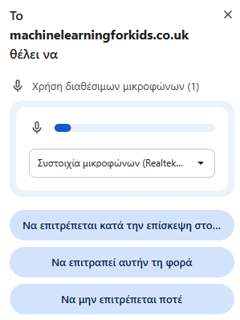

## Ρύθμιση του έργου

<html>

<iframe style="position: absolute; top: 0; left: 0; right: 0; width: 100%; height: 100%; border: none;" src="https://www.youtube.com/embed/K7g-nLoMBTA?rel=0&cc_load_policy=1" width="560" height="315" allowfullscreen allow="accelerometer; autoplay; clipboard-write; encrypted-media; gyroscope; picture-in-picture; web-share"></iframe>

</html>

\--- task ---

Πήγαινε στο [machinelearningforkids.co.uk](https://machinelearningforkids.co.uk/#!/login){:target="_blank"} με ένα πρόγραμμα περιήγησης ιστού.

Κάνε κλικ στο **Δοκιμή τώρα**.

\--- /task ---

\--- task ---

Κάνε κλικ στο **Έργα** στη γραμμή μενού στο επάνω μέρος.

Κάνε κλικ στο κουμπί **Προσθήκη νέου έργου**.

Ονόμασε το έργο σου «Τροφή για ψάρια» και ρύθμισέ το ώστε να μαθαίνει να αναγνωρίζει **ήχους** και να αποθηκεύει δεδομένα **στο πρόγραμμα περιήγησης ιστού**. Στη συνέχεια, κάνε κλικ στο κουμπί **Δημιουργία**.

Θα πρέπει τώρα να δεις την επιλογή «Τροφή για ψάρια» στη λίστα έργων. Κάνε κλικ στο έργο.

\--- /task ---

\--- task ---

Κάνε κλικ στο κουμπί **Εκπαίδευση**.

Εάν δεις ένα αναδυόμενο μήνυμα που σου ζητά άδεια να χρησιμοποιήσει το μικρόφωνο, κάνε κλικ στην επιλογή **Να επιτρέπεται κατά την επίσκεψη**.

\--- /task ---

