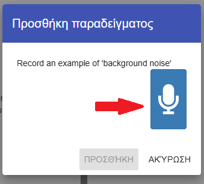
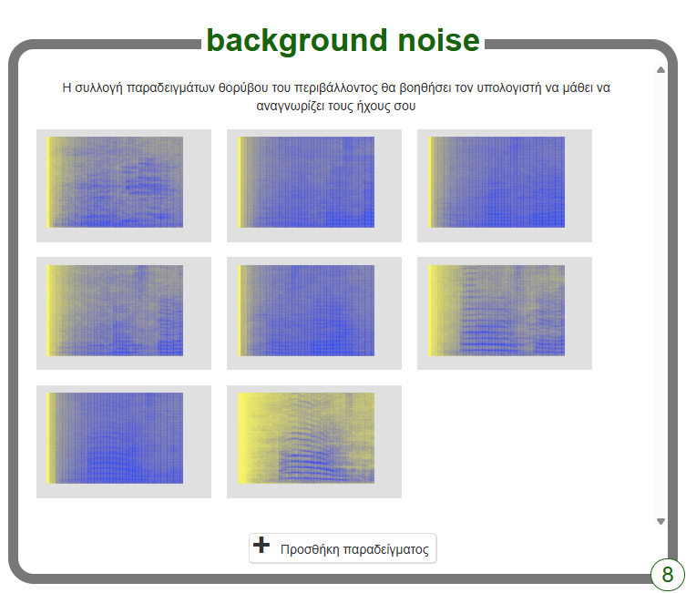

## Background noise (Θόρυβος περιβάλλοντος)

<html>

<iframe style="position: absolute; top: 0; left: 0; right: 0; width: 100%; height: 100%; border: none;" src="https://www.youtube.com/embed/QQ7tSOlbyaY?rel=0&cc_load_policy=1" width="560" height="315" allowfullscreen allow="accelerometer; autoplay; clipboard-write; encrypted-media; gyroscope; picture-in-picture; web-share"></iframe>

</html>

Αρχικά, θα συλλέξεις δείγματα θορύβου περιβάλλοντος. Αυτό θα βοηθήσει το μοντέλο μηχανικής μάθησης να διακρίνει τη διαφορά μεταξύ των φωνητικών σου εντολών και του θορύβου του περιβάλλοντος στο σημείο που βρίσκεσαι.

--- task ---

Κάνε κλικ στο κουμπί **+ Προσθήκη παραδείγματος** στην περιοχή **background noise**.

Κάνε κλικ στο μικρόφωνο, αλλά μην πεις τίποτα για να καταγράψεις 2 δευτερόλεπτα θορύβου από το περιβάλλον.

Κάνε κλικ στο κουμπί **Προσθήκη** για να αποθηκεύσεις την ηχογράφηση.

--- /task ---

--- task ---

Επανάλαβε αυτά τα βήματα έως ότου έχεις **τουλάχιστον 8 παραδείγματα** θορύβου περιβάλλοντος.

--- /task ---
