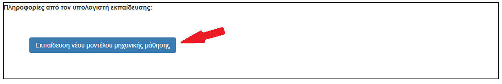
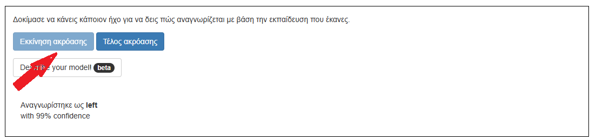

## Εκπαίδευση του μοντέλου

<html>

<iframe style="position: absolute; top: 0; left: 0; right: 0; width: 100%; height: 100%; border: none;" src="https://www.youtube.com/embed/7UVZ5Mqp1iY?rel=0&cc_load_policy=1" width="560" height="315" allowfullscreen allow="accelerometer; autoplay; clipboard-write; encrypted-media; gyroscope; picture-in-picture; web-share"></iframe>

</html>

Έχεις συγκεντρώσει τα παραδείγματα που χρειάζεσαι και τώρα θα τα χρησιμοποιήσεις για να εκπαιδεύσεις το μοντέλο μηχανικής μάθησης.

\--- task ---

Κάνε κλικ στο **< Επιστροφή στο έργο** στην επάνω αριστερή γωνία.

Κάνε κλικ στο **Εκμάθηση και Δοκιμή**.

Κάνε κλικ στο κουμπί με την ένδειξη **Εκπαίδευση νέου μοντέλου μηχανικής μάθησης**. Αυτό μπορεί να διαρκέσει μερικά λεπτά για να ολοκληρωθεί.

\--- /task ---

Μόλις ολοκληρωθεί η εκπαίδευση, μπορείς να ελέγξεις πόσο καλά αναγνωρίζει το μοντέλο σου τις φωνητικές σου εντολές.

\--- task ---

Κάνε κλικ στο κουμπί **Εκκίνηση ακρόασης** και, στη συνέχεια, πες "αριστερά".

\--- /task ---

Αν το μοντέλο της μηχανικής μάθησης το αναγνωρίσει, θα εμφανίσει αυτό που νομίζει ότι είπες.

\--- task ---

Έλεγξε αν το μοντέλο αναγνωρίζει επίσης τις λέξεις «πάνω», «κάτω» και «δεξιά».

\--- /task ---

Αν δεν είσαι ευχαριστημένος/η με το πώς το μοντέλο λειτουργεί, πήγαινε πίσω στην **Εκπαίδευση** και πρόσθεσε περισσότερα παραδείγματα, και εκπαίδευσε πάλι το μοντέλο.

