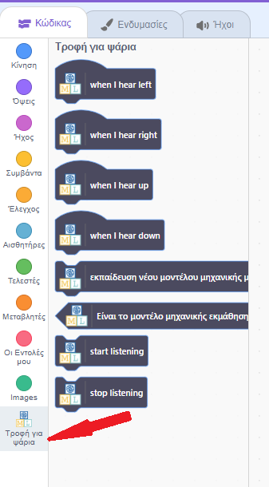
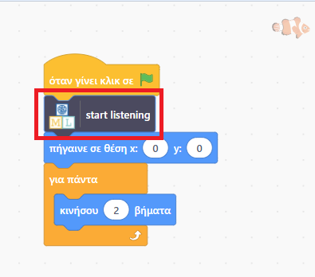
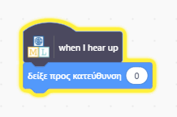
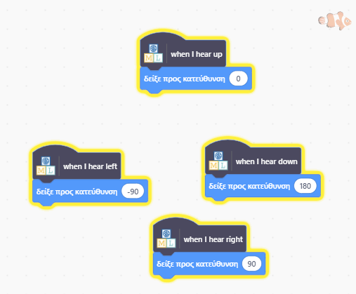

## Μετακίνηση του ψαριού

<html>

<iframe style="position: absolute; top: 0; left: 0; right: 0; width: 100%; height: 100%; border: none;" src="https://www.youtube.com/embed/Gy54IjEGRTY?rel=0&cc_load_policy=1" width="560" height="315" allowfullscreen allow="accelerometer; autoplay; clipboard-write; encrypted-media; gyroscope; picture-in-picture; web-share"></iframe>

</html>

Τώρα που το μοντέλο σου μπορεί να διακρίνει μεταξύ λέξεων, μπορείς να το χρησιμοποιήσεις σε ένα πρόγραμμα Scratch για να μετακινήσεις ένα ψάρι στην οθόνη.

--- task ---

Κάνε κλικ στον σύνδεσμο **< Επιστροφή στο έργο**.

Κάνε κλικ στο **Υλοποίηση**.

Κάνε κλικ στο **Scratch 3**.

Κάνε κλικ στο **Άνοιγμα στο Scratch 3**.

--- /task ---

--- task ---

Κάνε κλικ στα **Πρότυπα έργων** στην κορυφή και επίλεξε το έργο «Fish food» για να φορτώσεις το αντικείμενο fish, στο οποίο έχει ήδη προστεθεί κάποιος κώδικας.

--- /task ---

Το Machine Learning for Kids έχει προσθέσει ορισμένα ειδικά μπλοκ στο Scratch για να σου επιτρέψει να χρησιμοποιήσεις το μοντέλο που μόλις εκπαίδευσες. Θα τα βρεις στο κάτω μέρος της λίστας των μπλοκ.

--- task ---

Με επιλεγμένο το αντικείμενο **fish**, κάνε κλικ στην καρτέλα **Κώδικας**. Βρες τη σωστή θέση στον κώδικα και πρόσθεσε ένα ειδικό μπλοκ για να πεις στο μοντέλο να ξεκινήσει την ακρόαση.

--- /task ---

--- task ---

Πρόσθεσε τον κώδικα για το 'up' στο αντικείμενο **Fish**.

--- /task ---

--- task ---

Κοίτα τον κώδικα που έχεις για να μετακινήσεις το ψάρι προς τα πάνω και μετά δες αν μπορείς να βρεις τον κώδικα για κάτω, αριστερά και δεξιά.

--- collapse ---
---
title: Δείξε μου πώς
---

--- /collapse ---

--- /task ---

--- task ---

Κάνε κλικ στην **πράσινη σημαία** και πες πάνω, κάτω, αριστερά ή δεξιά. Έλεγξε ότι το ψάρι κινείται προς την κατεύθυνση που περιμένεις.

--- /task ---

