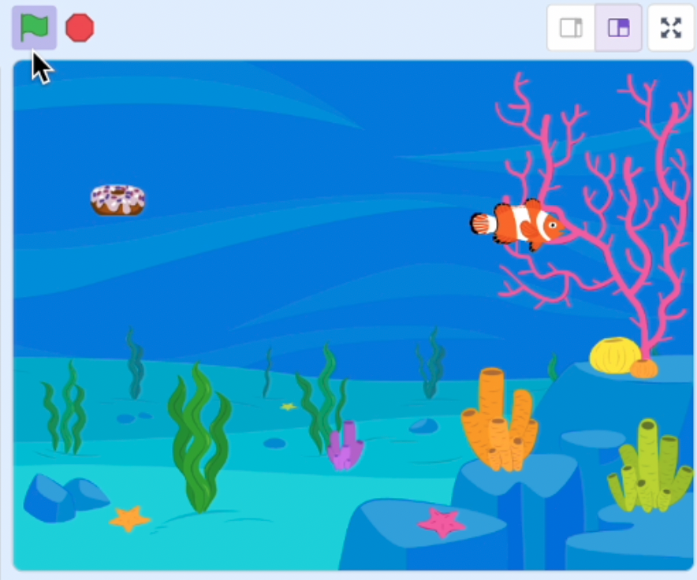

## Introduction

Train a machine learning model to recognise voice commands 'up', 'down', 'left', and 'right', and use them to control a fish in a fun game.

You will need a **microphone**.

--- collapse ---

---
title: Where are my voice commands stored?
---

- This project uses a technology called 'machine learning'. Machine learning systems are trained using a large amount of data. 
- Our projects do not require you to create an account or log in. For our projects, the voice command examples you use to make the model are only stored temporarily in your browser (only on your machine).
--- /collapse ---

--- collapse ---
---
title: No YouTube? Download the videos!
---

You can download all the videos for this project, including the above video [by clicking here](https://rpf.io/p/en/fish-food-go){:target="_blank"}. 

--- /collapse ---
