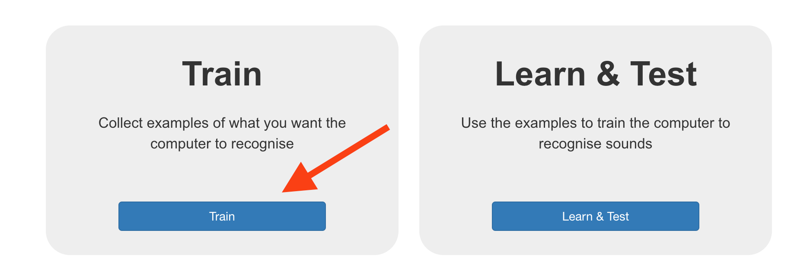

## Set up the project

<html>

<iframe style="position: absolute; top: 0; left: 0; right: 0; width: 100%; height: 100%; border: none;" src="https://www.youtube.com/embed/W-ne6SjYea4?rel=0&cc_load_policy=1" width="560" height="315" allowfullscreen allow="accelerometer; autoplay; clipboard-write; encrypted-media; gyroscope; picture-in-picture; web-share"></iframe>

</html>

--- task ---
+ Go to [machinelearningforkids.co.uk](https://machinelearningforkids.co.uk/#!/login){:target="_blank"} in a web browser. 

+ Click on **Try it now**.
--- /task ---

--- task ---
+ Click on **Projects** in the menu bar at the top.

+ Click on the **+ Add a new project** button.

+ Name your project 'Fish food' and set it to learn to recognise **sounds**, and store data **in your web browser**. Then click on **Create**.

+ You should now see 'Fish food' in the projects list. Click on the project.

--- /task ---

--- task ---
+ Click on the **Train** button.

+ If you see a popup message asking to use the microphone, click on **Allow on every visit**

--- /task ---

