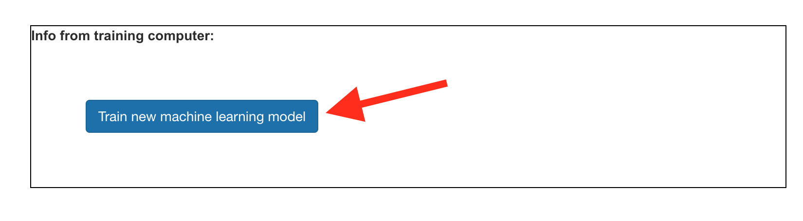
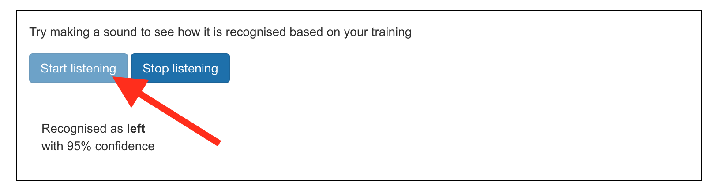

## Train the model

You have gathered the examples you need, now you will use these examples to train your machine learning model.

--- task ---

+ Click on **Back to project** in the top left-hand corner.

+ Click on **Learn & Test**.

+ Click on the button labelled **Train new machine learning model**. This may take a few minutes to complete.

--- /task ---

Once the training has finished, you can test how well your model recognises the alien words you have invented.  

--- task ---

+ Click the **Start listening** button, then say your alien word for "left". 

If your machine learning model recognises it, it will display what it thinks you said.

+ Test whether the model recognises your alien word for "right" as well.

--- /task ---

If you are not happy with how the model is working, go back to the **Train** page and add more examples, then train your model again.

