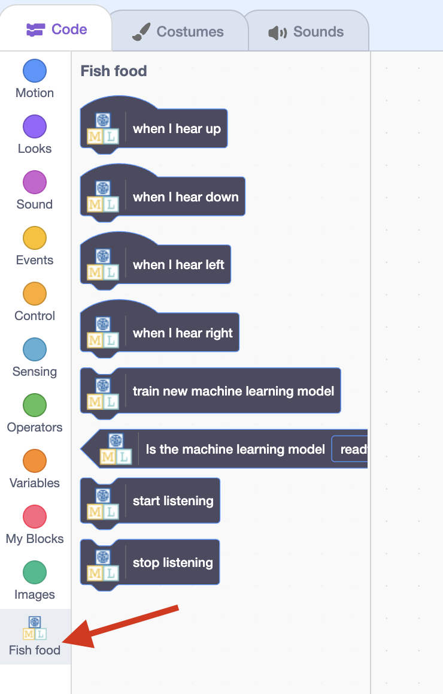

## Move the fish

<html>

<iframe style="position: absolute; top: 0; left: 0; right: 0; width: 100%; height: 100%; border: none;" src="https://www.youtube.com/embed/CBlSdth-pbA?rel=0&cc_load_policy=1" width="560" height="315" allowfullscreen allow="accelerometer; autoplay; clipboard-write; encrypted-media; gyroscope; picture-in-picture; web-share"></iframe>

</html>

Now that your model can distinguish between words, you can use it in a Scratch program to move a fish around the screen.

--- task ---
Click on the **< Back to project** link.

Click on **Make**.

Click on **Scratch 3**.

Click on **Open in Scratch 3**.

--- /task ---

--- task ---
Click on **Project templates** at the top and select the 'Fish food' project to load the fish sprite, which has some code already added to it. 

--- /task ---

Machine Learning for Kids has added some special blocks to Scratch to allow you to use the model you just trained. Find them at the bottom of the blocks list.

--- task ---

With the **fish** sprite selected, click on the **Code** tab. Find the right place in the code and add a special block to tell the model to start listening. 

--- /task ---

--- task ---

Add the code for 'up' to the **Fish** sprite. 

--- /task ---

--- task ---

Look at the code you have to move the fish up, then see if you can work out the code for down, left, and right.

--- collapse ---
---
title: Show me how
---

--- /collapse ---

--- /task ---

--- task ---
Click the **green flag** and say up, down, left, or right. Check that the fish moves in the direction you expected. 

--- /task ---

