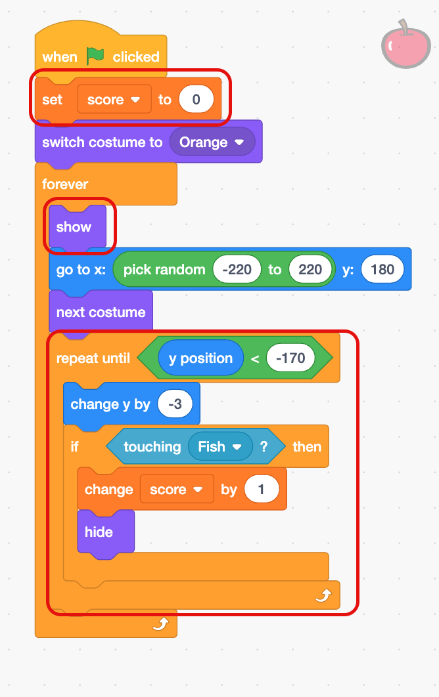

## Challenge

--- challenge ---

--- task ---
+ Add a variable to keep track of the score, and add a point each time the fish eats some food.

--- collapse ---
---
title: Show me how
---
Add the circled code to the **Food** sprite

--- /collapse ---

--- /task ---

--- task ---
+ Add a new sprite that is not food, and deduct points if the fish eats it.
--- /task ---

--- task ---
+ Make the food fall at different random speeds.
--- /task ---

--- task ---
+ Or, if you prefer, make a completely different game that uses voice commands to control a character!
--- /task ---

--- /challenge ---
