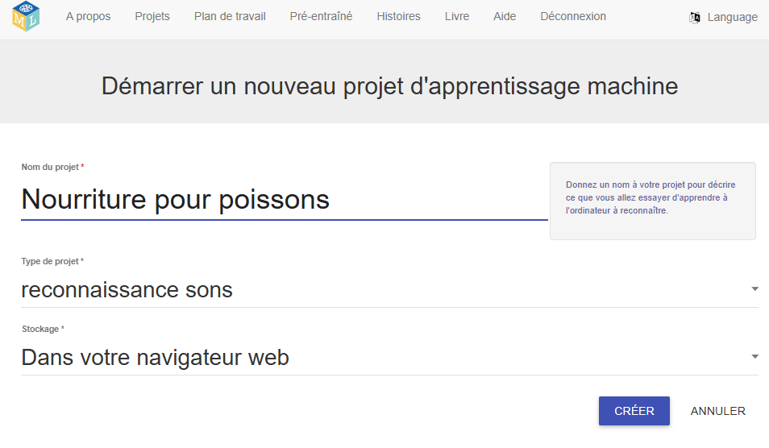
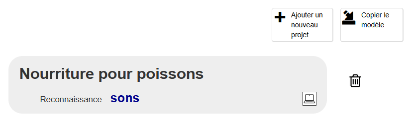
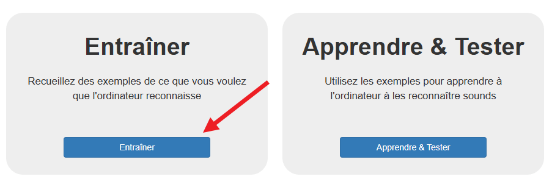
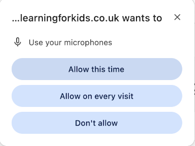

## Configurer le projet

<html>

<iframe style="position: absolute; top: 0; left: 0; right: 0; width: 100%; height: 100%; border: none;" src="https://www.youtube.com/embed/K7g-nLoMBTA?rel=0&cc_load_policy=1" width="560" height="315" allowfullscreen allow="accelerometer; autoplay; clipboard-write; encrypted-media; gyroscope; picture-in-picture; web-share"></iframe>

</html>

\--- task ---

Va sur [machinelearningforkids.co.uk](https://machinelearningforkids.co.uk/#!/login){:target="_blank"} dans un navigateur web.

Clique sur **Essayer maintenant**.

\--- /task ---

\--- task ---

Clique sur **Projets** dans la barre de menus en haut de la page.

Clique sur le bouton **+ Ajouter un nouveau projet**.

Nomme ton projet « Nourriture pour poissons » et définis-le pour apprendre à reconnaître les **sons**, et stocker les données **dans ton navigateur web**. Puis clique sur **Créer**.

Tu devrais maintenant voir « Nourriture pour poissons » dans la liste des projets. Clique sur le projet.

\--- /task ---

\--- task ---

Clique sur le bouton **Entraîner**.

Si tu vois un message contextuel te demandant d'utiliser le microphone, clique sur **Autoriser pendant la visite du site**.

\--- /task ---

