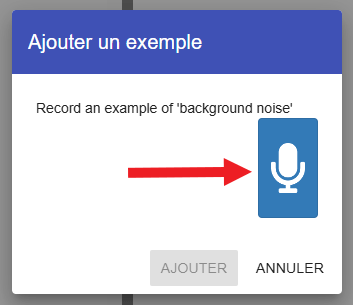
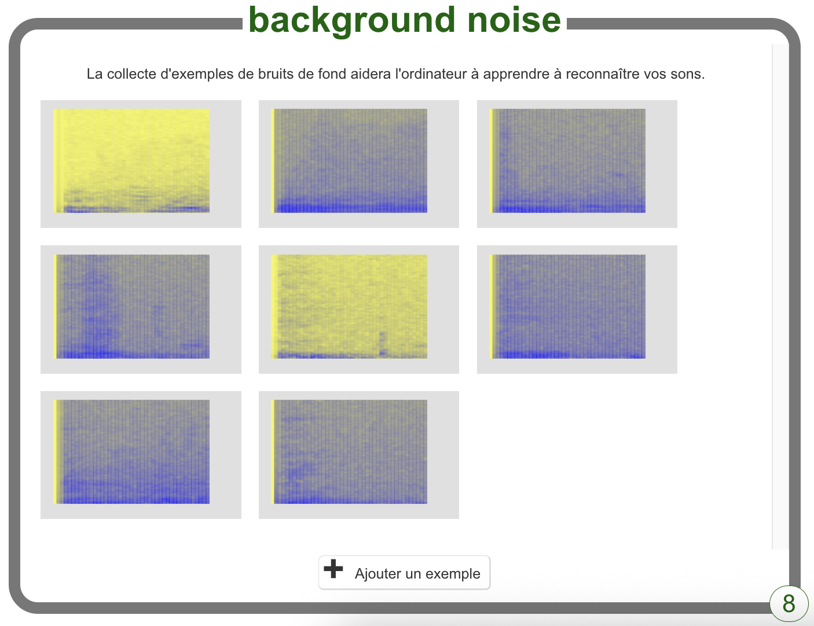

## Bruit de fond

<html>

<iframe style="position: absolute; top: 0; left: 0; right: 0; width: 100%; height: 100%; border: none;" src="https://www.youtube.com/embed/QQ7tSOlbyaY?rel=0&cc_load_policy=1" width="560" height="315" allowfullscreen allow="accelerometer; autoplay; clipboard-write; encrypted-media; gyroscope; picture-in-picture; web-share"></iframe>

</html>

Tout d'abord, tu vas collecter des échantillons de bruit de fond. Cela aidera ton modèle d’apprentissage automatique à faire la différence entre tes commandes vocales et le bruit de fond de ton environnement.

--- task ---

Clique sur le bouton **+ Ajouter un exemple** dans **background noise**.

Clique sur le microphone mais ne dis rien pour enregistrer 2 secondes de bruit de fond.

Clique sur le bouton **Ajouter** pour enregistrer ton enregistrement.

--- /task ---

--- task ---

Répète ces étapes jusqu'à ce que tu aies **au moins 8 exemples** de bruit de fond.

--- /task ---
