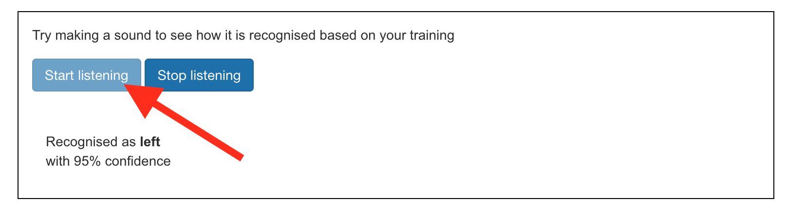

## Entraîner le modèle

<html>

<iframe style="position: absolute; top: 0; left: 0; right: 0; width: 100%; height: 100%; border: none;" src="https://www.youtube.com/embed/7UVZ5Mqp1iY?rel=0&cc_load_policy=1" width="560" height="315" allowfullscreen allow="accelerometer; autoplay; clipboard-write; encrypted-media; gyroscope; picture-in-picture; web-share"></iframe>

</html>

Tu as rassemblé les exemples dont tu as besoin, tu vas maintenant utiliser ces exemples pour entraîner ton modèle d'apprentissage automatique.

\--- task ---

Clique sur **< Revenir au projet** dans le coin supérieur gauche.

Clique sur **Apprendre & Tester**.

Clique sur le bouton **Entraîner un nouveau modèle d'apprentissage machine**. Cela peut prendre quelques minutes.

\--- /task ---

Une fois l'entraînement terminé, tu peux tester comment ton modèle reconnaît tes commandes vocales.

\--- task ---

Clique sur le bouton **Commencez à écouter**, puis dis « gauche ».

\--- /task ---

Si ton modèle d'apprentissage automatique le reconnaît, il affichera ce qu'il te prédit.

\--- task ---

Teste si le modèle reconnaît également « haut », « bas » et « droite ».

\--- /task ---

Si tu n'es pas satisfait·e de la façon dont le modèle fonctionne, retourne à la page **Entraîner** et ajoute d'autres exemples, puis entraîne ton modèle à nouveau.

