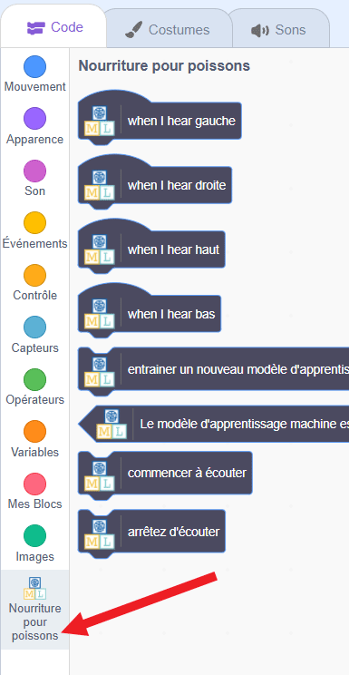
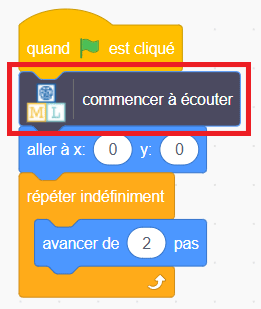
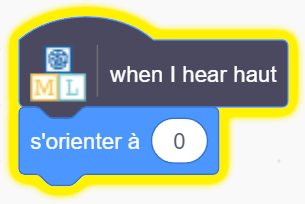
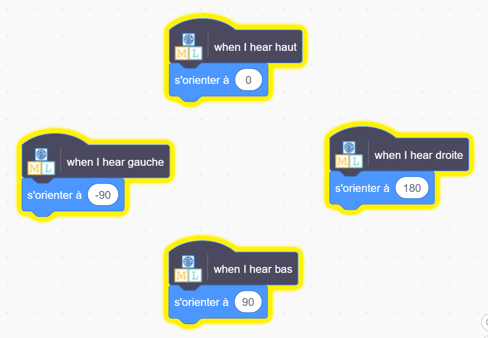

## Déplacer le poisson

<html>

<iframe style="position: absolute; top: 0; left: 0; right: 0; width: 100%; height: 100%; border: none;" src="https://www.youtube.com/embed/Gy54IjEGRTY?rel=0&cc_load_policy=1" width="560" height="315" allowfullscreen allow="accelerometer; autoplay; clipboard-write; encrypted-media; gyroscope; picture-in-picture; web-share"></iframe>

</html>

Maintenant que ton modèle peut distinguer les mots, tu peux l’utiliser dans un programme Scratch pour déplacer un poisson sur l’écran.

--- task ---

Clique sur le lien **< Revenir au projet**.

Clique sur **Faire**.

Clique sur **Scratch 3**.

Clique sur **Ouvrir dans Scratch 3**.

--- /task ---

--- task ---

Clique sur **Modèles de projet** en haut et sélectionne le projet « Fish Food » pour charger le sprite poisson, auquel du code a déjà été ajouté.

--- /task ---

Machine Learning for Kids a ajouté des blocs spéciaux à Scratch pour te permettre d'utiliser le modèle que tu viens d'entraîner. Trouve-les en bas de la liste des blocs.

--- task ---

Avec le sprite **poisson** sélectionné, clique sur l'onglet **Code**. Trouve le bon endroit dans le code et ajoute un bloc spécial pour indiquer au modèle de commencer à écouter.

--- /task ---

--- task ---

Ajoute le code pour « haut » au sprite **Poisson**.

--- /task ---

--- task ---

Regarde le code que tu dois utiliser pour déplacer le poisson vers le haut, puis vois si tu peux déterminer le code pour le bas, la gauche et la droite.

--- collapse ---
---
title: Montre-moi comment
---

--- /collapse ---

--- /task ---

--- task ---

Clique sur le **drapeau vert** et dis haut, bas, gauche ou droite. Vérifie que le poisson se déplace dans la direction souhaitée.

--- /task ---

