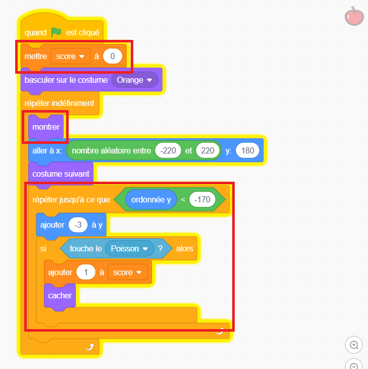

## Défi

--- challenge ---

--- task ---

Ajoute une variable pour suivre le score et ajoute un point à chaque fois que le poisson mange de la nourriture.

--- collapse ---
---
title: Montre-moi comment
---

Ajoute le code entouré au sprite **Nourriture**.

--- /collapse ---

--- /task ---

--- task ---

Ajoute un nouveau sprite qui n'est pas de la nourriture, et déduit des points si le poisson le mange.

--- /task ---

--- task ---

Fais tomber les aliments à différentes vitesses aléatoires.

--- /task ---

--- task ---

Ou, si tu préfères, crée un jeu complètement différent qui utilise des commandes vocales pour contrôler un personnage !

--- /task ---

--- /challenge ---
