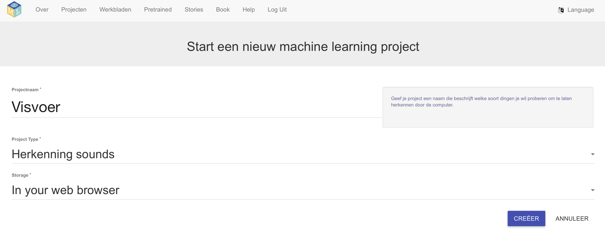
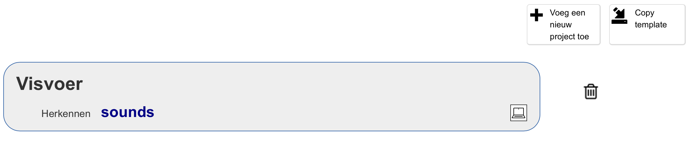
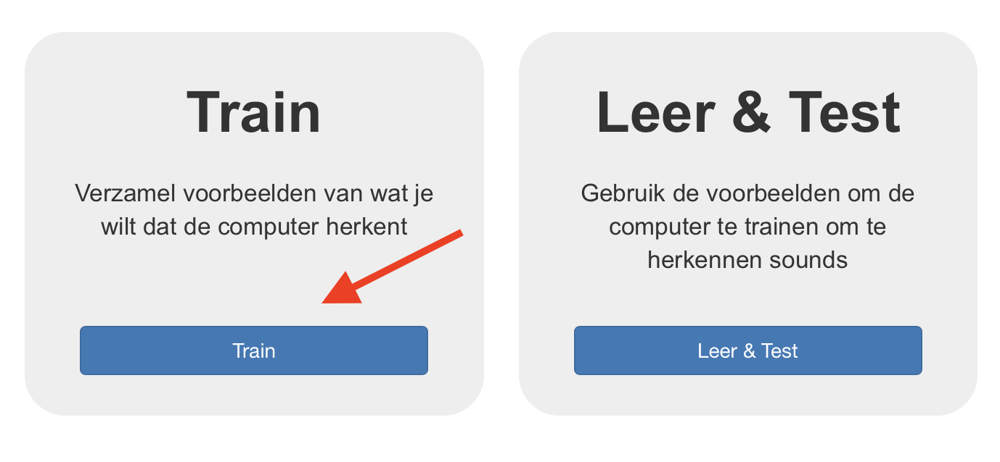
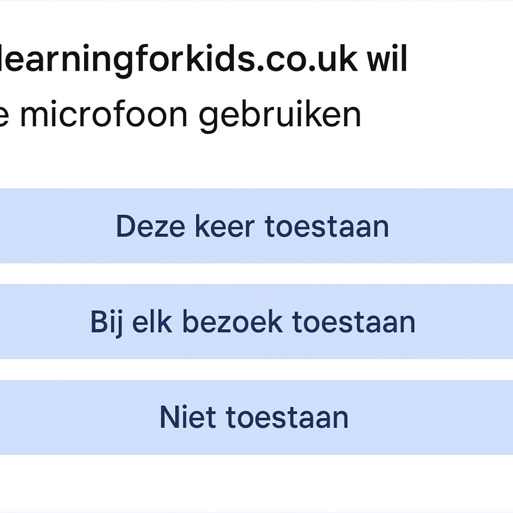

## Het project opzetten

<html>

<iframe style="position: absolute; top: 0; left: 0; right: 0; width: 100%; height: 100%; border: none;" src="https://www.youtube.com/embed/K7g-nLoMBTA?rel=0&cc_load_policy=1" width="560" height="315" allowfullscreen allow="accelerometer; autoplay; clipboard-write; encrypted-media; gyroscope; picture-in-picture; web-share"></iframe>

</html>

\--- task ---

Ga naar [machinelearningforkids.co.uk](https://machinelearningforkids.co.uk/#!/login){:target="_blank"} in een webbrowser.

Klik op **Probeer nu**.

\--- /task ---

\--- task ---

Klik op **Projecten** in de menubalk bovenaan.

Klik op de knop **+ Voeg een nieuw project toe**.

Geef je project de naam 'Visvoer' en geef het de opdracht om **geluiden (sounds)** te herkennen en gegevens **in je webbrowser (in your webbrowser)** op te slaan. Klik vervolgens op **Creëer**.

Je zou nu 'Visvoer' moeten zien in de projectenlijst. Klik op dit project.

\--- /task ---

\--- task ---

Klik op de knop **Train**.

Als je een pop-upbericht ziet met de vraag om de microfoon te gebruiken, klik dan op **Toestaan bij elk bezoek**.

\--- /task ---

