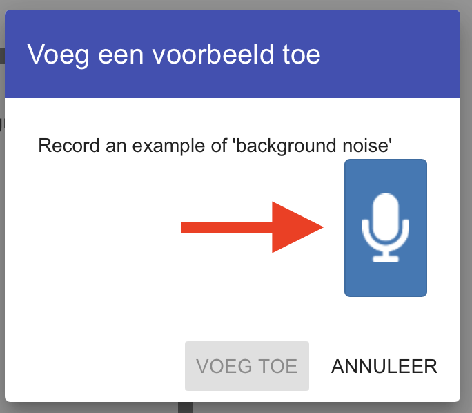
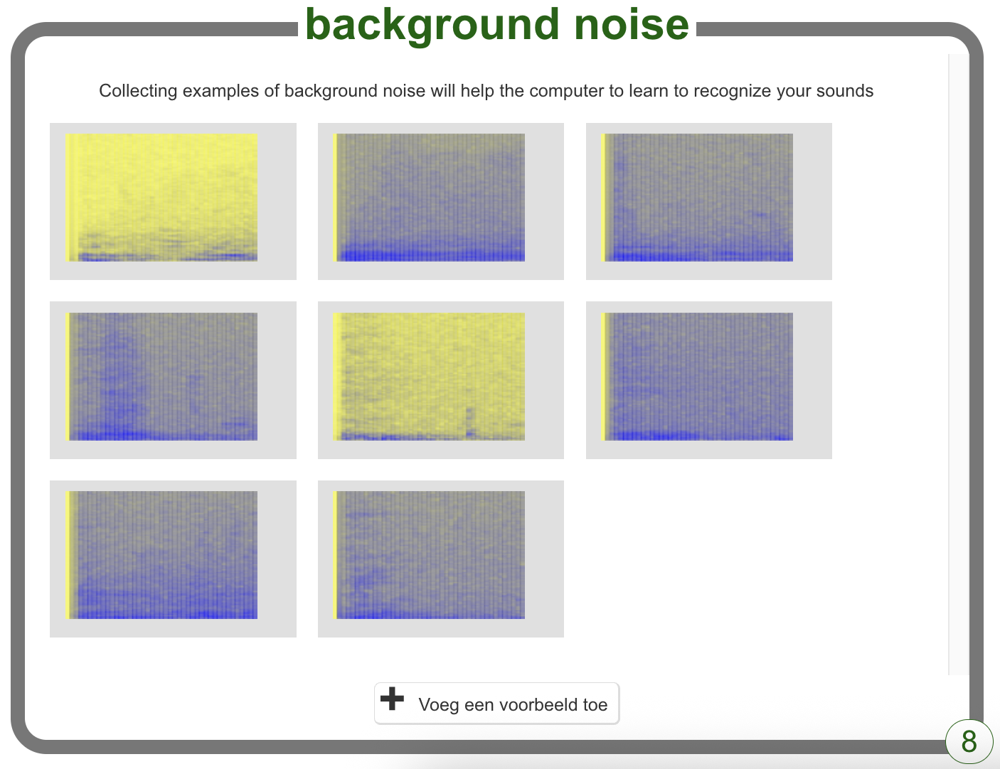

## Achtergrondgeluid

<html>

<iframe style="position: absolute; top: 0; left: 0; right: 0; width: 100%; height: 100%; border: none;" src="https://www.youtube.com/embed/QQ7tSOlbyaY?rel=0&cc_load_policy=1" width="560" height="315" allowfullscreen allow="accelerometer; autoplay; clipboard-write; encrypted-media; gyroscope; picture-in-picture; web-share"></iframe>

</html>

Eerst verzamel je voorbeelden van achtergrondgeluiden. Dit zal je machine learning model helpen om het verschil te weten tussen je spraakcommando's en het achtergrondgeluid van de plek waar je bent.

\--- task ---

Klik op de **+ voeg een voorbeeld toe** knop in **background noise**.

Klik op de microfoon, maar zeg niets om 2 seconden achtergrondgeluid op te nemen.

Klik op de knop **VOEG TOE** om jouw opname op te slaan.

\--- /task ---

\--- task ---

Herhaal deze stappen totdat je **minstens 8 voorbeelden** van achtergrondgeluiden hebt.

\--- /task ---
