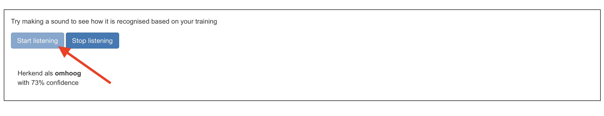

## Train het model

<html>

<iframe style="position: absolute; top: 0; left: 0; right: 0; width: 100%; height: 100%; border: none;" src="https://www.youtube.com/embed/7UVZ5Mqp1iY?rel=0&cc_load_policy=1" width="560" height="315" allowfullscreen allow="accelerometer; autoplay; clipboard-write; encrypted-media; gyroscope; picture-in-picture; web-share"></iframe>

</html>

Je hebt de voorbeelden verzameld die je nodig hebt, nu ga je deze gebruiken om jouw machine learning-model te trainen.

\--- task ---

Klik op **<Terug naar project** in de linkerbovenhoek.

Klik op **Leer & Test**.

Klik op de knop met het label **Train nieuw machine learning model**. Dit kan enkele minuten duren.

\--- /task ---

Zodra het trainen is voltooid, kun je testen hoe goed jouw model jouw spraakopdrachten herkent.

\--- task ---

Klik op de **Start listening** knop en zeg dan "links".

\--- /task ---

Als je machine learning-model dit herkent, wordt weergegeven wat het model voorspelt dat jij hebt gezegd.

\--- task ---

Test of het model ook "omhoog", "omlaag" en "rechts" herkent.

\--- /task ---

Als je niet tevreden bent met hoe het model werkt, ga dan terug naar de **Train** pagina en voeg meer voorbeelden toe, en train daarna je model opnieuw.

