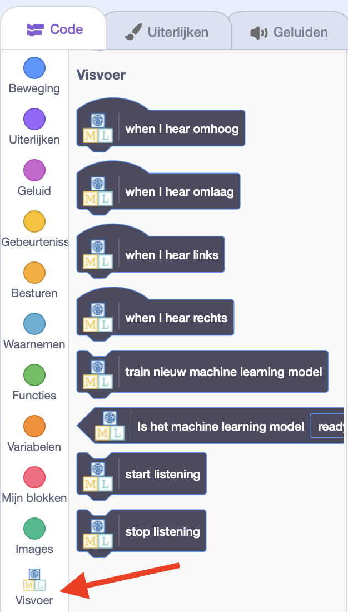
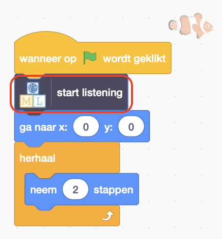
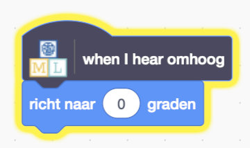
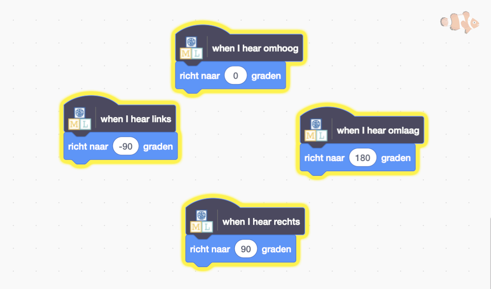

## Verplaats de vis

<html>

<iframe style="position: absolute; top: 0; left: 0; right: 0; width: 100%; height: 100%; border: none;" src="https://www.youtube.com/embed/Gy54IjEGRTY?rel=0&cc_load_policy=1" width="560" height="315" allowfullscreen allow="accelerometer; autoplay; clipboard-write; encrypted-media; gyroscope; picture-in-picture; web-share"></iframe>

</html>

Nu je model verschillende woorden kan onderscheiden, kun je het gebruiken in een Scratch-programma om een vis over het scherm te verplaatsen.

--- task ---

Klik op de link **< Terug naar project**.

Klik op **Maak**.

Klik op **Scratch 3**.

Klik op **Open in Scratch 3**.

--- /task ---

--- task ---

Klik bovenaan op **Projectsjablonen** en selecteer het project 'Fish food' om de vissprite te laden, waaraan al wat code is toegevoegd.

--- /task ---

Machine Learning for Kids heeft een paar speciale blokken aan Scratch toegevoegd om het model dat je net hebt getraind te kunnen gebruiken. Je vindt ze onderaan de lijst met blokken.

--- task ---

Selecteer de **vis**-sprite en klik op het tabblad **Code**. Zoek de juiste plaats in de code en voeg een speciaal blok toe om het model te vertellen om te beginnen met luisteren.

--- /task ---

--- task ---

Voeg de code voor 'omhoog' toe aan de sprite **Vis**.

--- /task ---

--- task ---

Kijk naar de code die je de vis omhoog moet laten bewegen, en kijk dan of je zelf de code kunt bedenken voor omlaag, links en rechts.

--- collapse ---
---
title: Laat me zien hoe ik het moet doen
---

--- /collapse ---

--- /task ---

--- task ---

Klik op de **groene vlag** en zeg omhoog, omlaag, links of rechts. Controleer of de vis in de richting zwemt die je had verwacht.

--- /task ---

