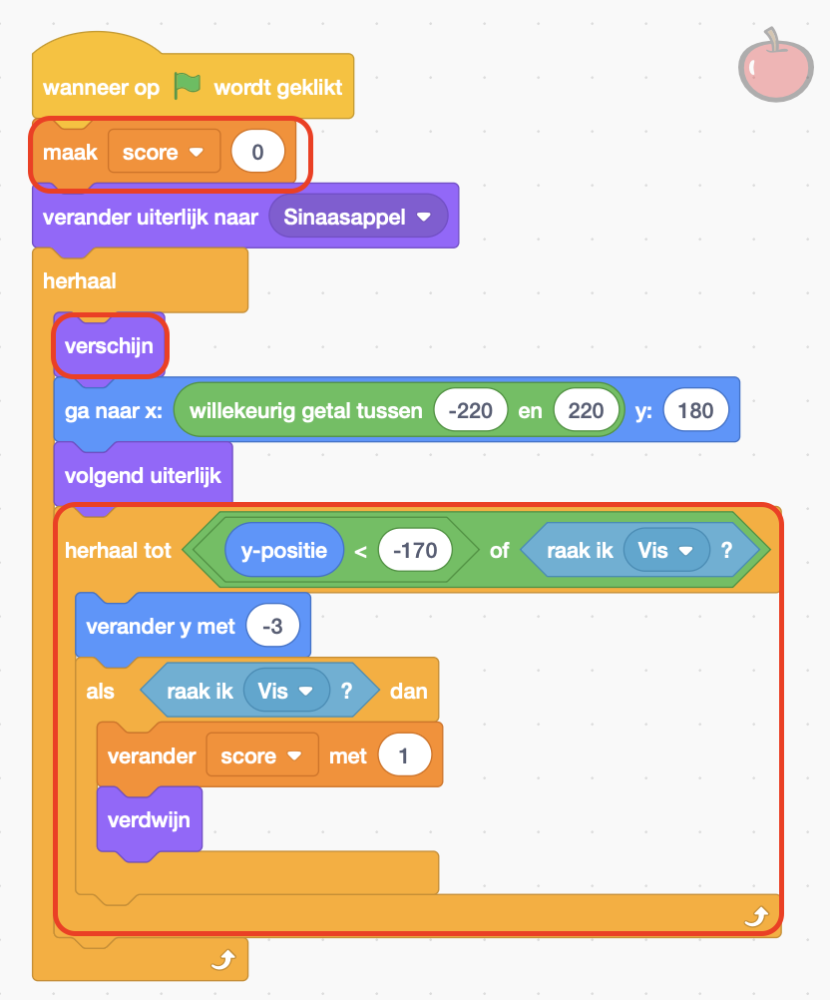

## Uitdaging

--- challenge ---

--- task ---

Voeg een variabele toe om de score bij te houden en voeg een punt toe telkens wanneer de vis iets eet van het voer.

--- collapse ---
---
title: Laat me zien hoe ik het moet doen
---

Voeg de omcirkelde code toe aan de sprite **Voer**.

--- /collapse ---

--- /task ---

--- task ---

Voeg een nieuwe sprite toe die geen voer is, en trek punten af als de vis deze opeet.

--- /task ---

--- task ---

Laat het eten met verschillende, willekeurige snelheden vallen.

--- /task ---

--- task ---

Of maak, als je dat liever hebt, een compleet ander spel waarbij je een personage bestuurt met spraakcommando's!

--- /task ---

--- /challenge ---
