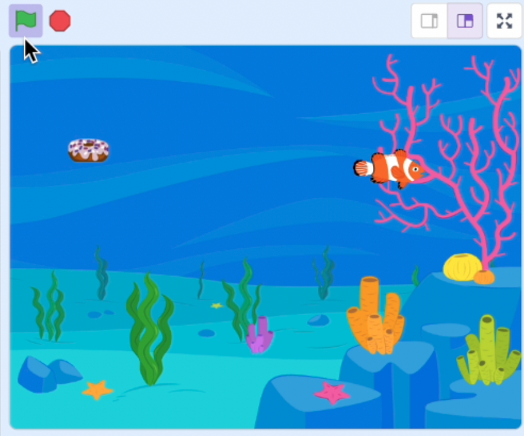

## Introdução

Treina o modelo de machine learning para reconhecer os comandos de voz "para cima", "para baixo", "esquerda" e "direita", e utiliza-os para controlar o peixe num jogo divertido.

Vais precisar de um **microfone**.

--- collapse ---

---

## title: Onde ficam guardados os meus comandos de voz?

- Este projeto usa uma tecnologia chamada "machine learning". Os sistemas de machine learning são treinados com uma grande quantidade de dados.
- Este projeto não exige que cries uma conta ou faças login. Para este projeto, os exemplos que usas para fazer o modelo são armazenados temporariamente no teu navegador (apenas na tua máquina).

--- /collapse ---

--- collapse ---
---
title: Não tens Youtube? Descarrega estes vídeos!
---

Podes [descarregar todos os vídeos para este projeto](https://rpf.io/p/pt-PT/fish-food-go){:target="_blank"}.

--- /collapse ---
