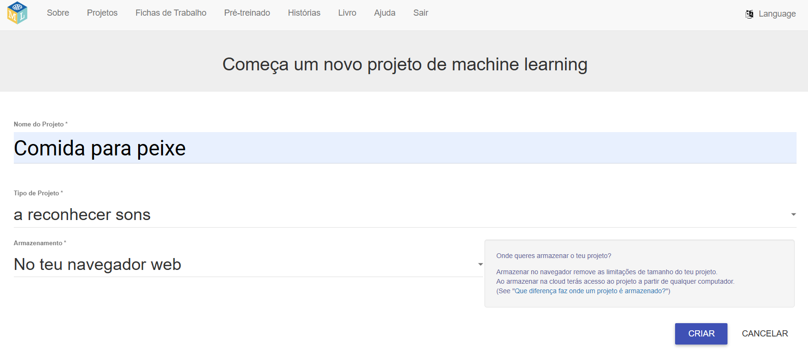
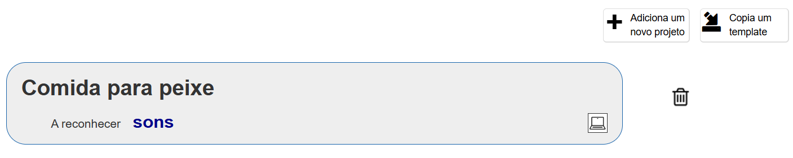
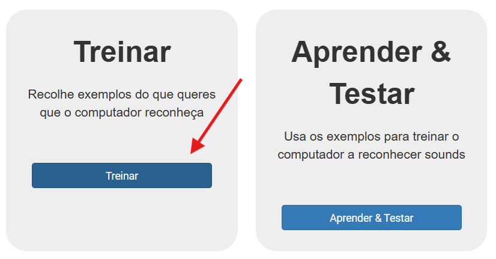
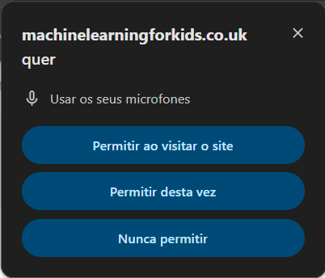

## Cria o teu projeto

<html>

<iframe style="position: absolute; top: 0; left: 0; right: 0; width: 100%; height: 100%; border: none;" src="https://www.youtube.com/embed/K7g-nLoMBTA?rel=0&cc_load_policy=1" width="560" height="315" allowfullscreen allow="accelerometer; autoplay; clipboard-write; encrypted-media; gyroscope; picture-in-picture; web-share"></iframe>

</html>

\--- task ---

Vai para [machinelearningforkids.co.uk](https://machinelearningforkids.co.uk/#!/login){:target="_blank"} num navegador web.

Clica em **Experimenta agora**.

\--- /task ---

\--- task ---

Clica em **Projetos** na barra do menu na parte superior.

Clica no botão **+ Adicionar um novo projeto**.

Dá nome ao teu projeto `Comida para peixe` e configura-o para aprender a reconhecer **sons** e armazenar dados **no teu navegador web**. E clica em **Criar**.

Deves ver agora "Comida para peixe" na lista de projetos. Clica em cima do projeto.

\--- /task ---

\--- task ---

Clica no botão **Treinar**.

Se vires uma mensagem pop-up a solicitar a utilização do microfone, clica em **Permitir em todas as visitas**.

\--- /task ---

