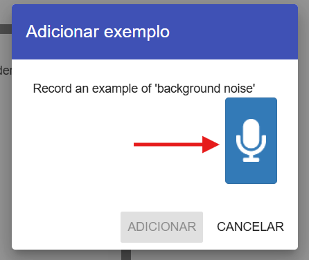
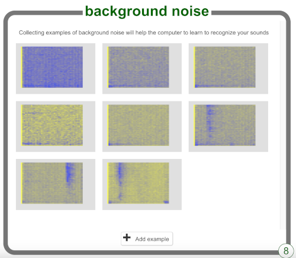

## Ruído de fundo

<html>

<iframe style="position: absolute; top: 0; left: 0; right: 0; width: 100%; height: 100%; border: none;" src="https://www.youtube.com/embed/QQ7tSOlbyaY?rel=0&cc_load_policy=1" width="560" height="315" allowfullscreen allow="accelerometer; autoplay; clipboard-write; encrypted-media; gyroscope; picture-in-picture; web-share"></iframe>

</html>

Primeiro, vais recolher amostras do ruído de fundo. Isto vai ajudar o teu modelo de machine learning a distinguir os teus comandos de voz, do ruído de fundo do local onde estás.

\--- task ---

Clica no botão **+ Adicionar exemplos** em **background noise**.

Clica no microfone, mas não digas nada, para gravar 2 segundos de ruído de fundo.

Clica no botão **Adicionar** para guardar a tua gravação.

\--- /task ---

\--- task ---

Repete estes passos até teres **pelo menos 8 exemplos** de ruído de fundo.

\--- /task ---
