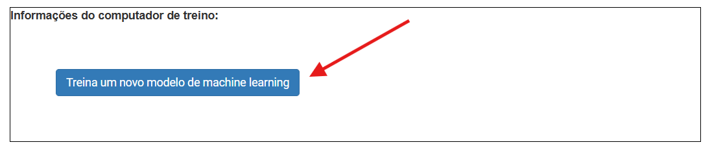
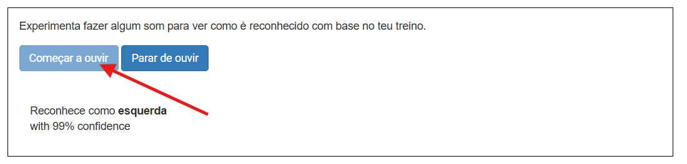

## Treina o modelo

<html>

<iframe style="position: absolute; top: 0; left: 0; right: 0; width: 100%; height: 100%; border: none;" src="https://www.youtube.com/embed/7UVZ5Mqp1iY?rel=0&cc_load_policy=1" width="560" height="315" allowfullscreen allow="accelerometer; autoplay; clipboard-write; encrypted-media; gyroscope; picture-in-picture; web-share"></iframe>

</html>

Reuniste os exemplos de que precisas, e agora vais usar esses exemplos para treinar o teu modelo de machine learning.

--- task ---

Clica em **< Voltar para o projeto** no canto superior esquerdo.

Clica em **Aprender & testar**.

Clica no botão chamado **Treinar um novo modelo de Machine Learning**. Isto pode demorar alguns minutos até acontecer.

--- /task ---

Quando o treino acabar, podes testar o quão bem o teu modelo reconhece os teus comandos de voz.

--- task ---

Clica no botão **Começar a ouvir**, e diz "esquerda".

--- /task ---

Se o teu modelo de machine learning reconhecer o comando de voz, vai exibir a previsão do que disseste.

--- task ---

Testa se o modelo também reconhece "para cima", "para baixo" e "direita".

--- /task ---

Se não ficares satisfeito com o funcionamento do modelo, volta à página **Treinar** e adiciona mais exemplos, depois treina o modelo outra vez.

