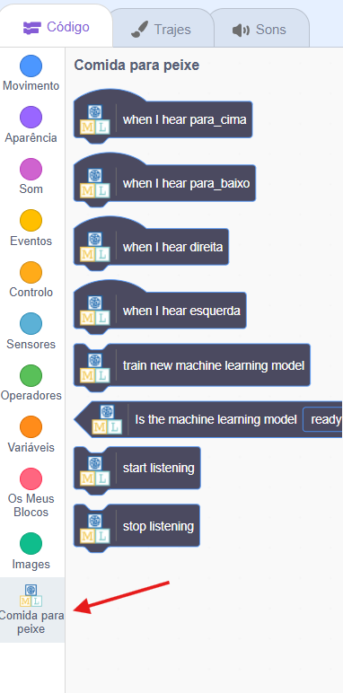
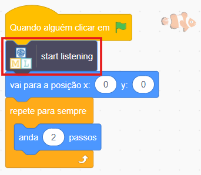
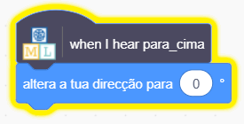
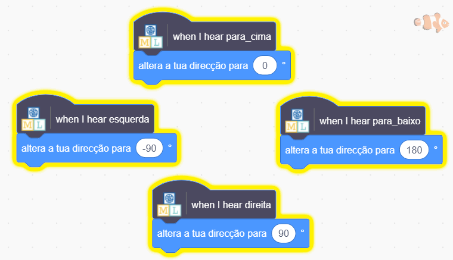

## Move o peixe

<html>

<iframe style="position: absolute; top: 0; left: 0; right: 0; width: 100%; height: 100%; border: none;" src="https://www.youtube.com/embed/Gy54IjEGRTY?rel=0&cc_load_policy=1" width="560" height="315" allowfullscreen allow="accelerometer; autoplay; clipboard-write; encrypted-media; gyroscope; picture-in-picture; web-share"></iframe>

</html>

Agora que o teu modelo consegue distinguir as palavras, podes usá-lo no programa Scratch para movimentar o peixe pelo ecrã.

\--- task ---

Clica no link **< Voltar para o projeto**.

Clica em **Criar**.

Clica em **Scratch 3**.

Clica em **Abrir no Scratch 3**.

\--- /task ---

\--- task ---

Clica em **Project templates** na parte superior e seleciona o projeto "Fish Food" para carregar o ator peixe, que já contém algum código adicionado.

\--- /task ---

Machine learning for Kids adicionou alguns blocos especiais ao Scratch para permitir que utilizes o modelo que acabaste de treinar. Encontra-os na última parte da lista de blocos.

\--- task ---

Com o ator **peixe** selecionado, clica no separador **Código**. Encontra o lugar certo no teu código e adiciona um bloco especial para dizer ao modelo para começar a ouvir.

\--- /task ---

\--- task ---

Adiciona o código de "para cima" ao ator **Peixe**.

\--- /task ---

\--- task ---

Observa o código que tens para movimentar o peixe para cima e tenta decifrar o código para movimentar para baixo, esquerda e direita.

## --- collapse ---

## title: Mostra-me como

\--- /collapse ---

\--- /task ---

\--- task ---

Clica na **bandeira verde** e diz para cima, para baixo, esquerda ou direita. Verifica se o peixe se movimenta na direção esperada.

\--- /task ---

