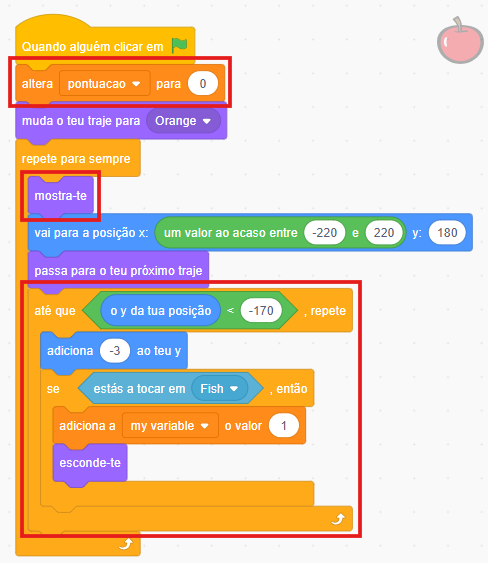

## Desafio

\--- challenge ---

\--- task ---

Adiciona a variável para acompanhar a pontuação e adiciona um ponto cada vez que o peixe comer alguma comida.

## --- collapse ---

## title: Mostra-me como

Adiciona o código destacado por um circulo ao ator **Food**.

\--- /collapse ---

\--- /task ---

\--- task ---

Adiciona um novo ator que não seja comida e deduz pontos se o peixe o comer.

\--- /task ---

\--- task ---

Faz com que a comida caia em diferentes velocidades aleatoriamente.

\--- /task ---

\--- task ---

Ou, se preferires, cria um jogo completamente diferente que usa comandos de voz para controlar o personagem!

\--- /task ---

\--- /challenge ---
