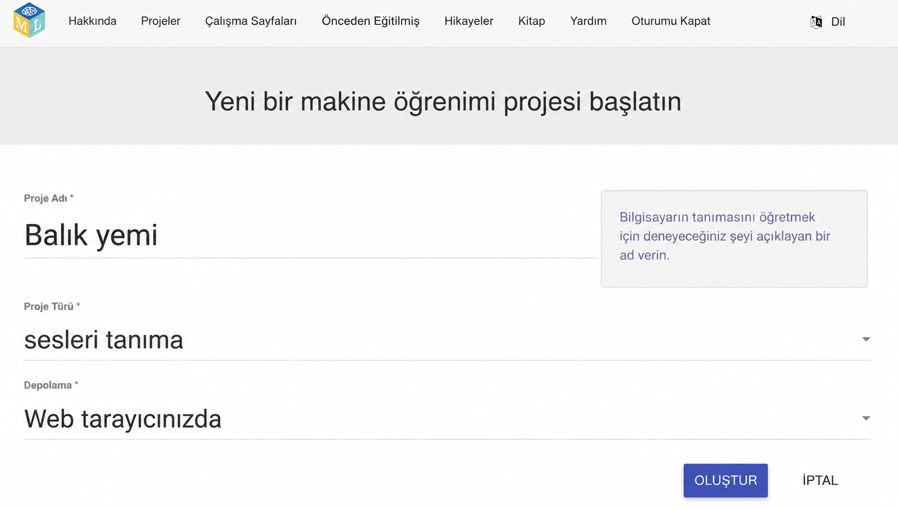
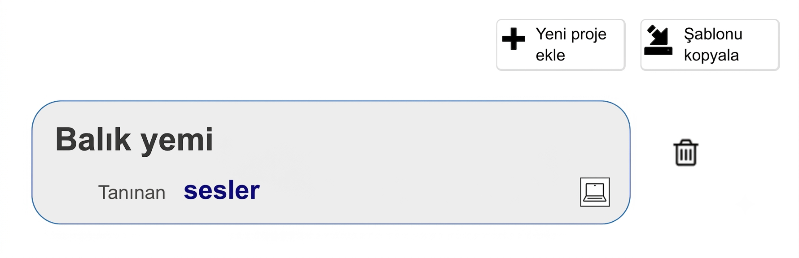
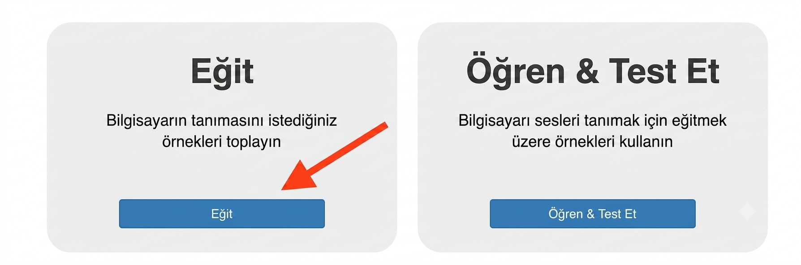
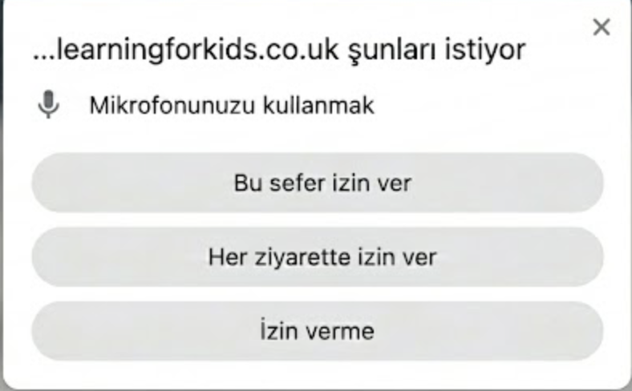

## Projeyi kurun

<html>

<iframe style="position: absolute; top: 0; left: 0; right: 0; width: 100%; height: 100%; border: none;" src="https://www.youtube.com/embed/K7g-nLoMBTA?rel=0&cc_load_policy=1" width="560" height="315" allowfullscreen allow="accelerometer; autoplay; clipboard-write; encrypted-media; gyroscope; picture-in-picture; web-share"></iframe>

</html>

\--- task ---

Bir web tarayıcısında [machinelearningforkids.co.uk](https://machinelearningforkids.co.uk/#!/login){:target="_blank"} adresine gidin.

**Şimdi dene**ye tıklayın.

\--- /task ---

\--- task ---

Üstteki menü çubuğunda **Projeler**'e tıklayın.

**+ Yeni proje ekle** düğmesine tıklayın.

Projenize `Balık Yemi` adını verin ve **sesleri** tanımayı öğrenmesi ve verileri **web tarayıcınızda** saklaması için ayarlayın. Ardından **Oluştur**'a tıklayın.

Projeler listesinde artık 'Balık yemi'ni görmelisiniz. Projeye tıklayın.

\--- /task ---

\--- task ---

**Eğit** düğmesine tıklayın.

Mikrofonu kullanmak için izin isteyen bir açılır pencere mesajı görürseniz, **Her ziyarette izin ver** seçeneğine tıklayın.

\--- /task ---

