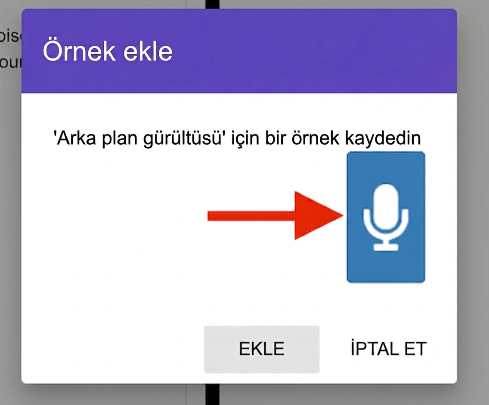
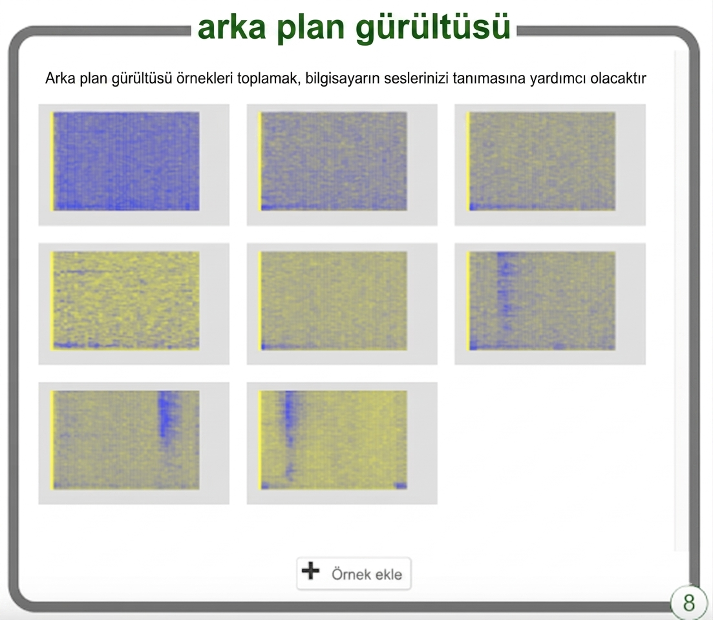

## Arka plan gürültüsü

<html>

<iframe style="position: absolute; top: 0; left: 0; right: 0; width: 100%; height: 100%; border: none;" src="https://www.youtube.com/embed/QQ7tSOlbyaY?rel=0&cc_load_policy=1" width="560" height="315" allowfullscreen allow="accelerometer; autoplay; clipboard-write; encrypted-media; gyroscope; picture-in-picture; web-share"></iframe>

</html>

Öncelikle, arka plan gürültüsü örnekleri toplayacaksınız. Bu, makine öğrenimi modelinizin sesli komutlarınız ile bulunduğunuz ortamdaki arka plan gürültüsü arasındaki farkı ayırt etmesine yardımcı olacaktır.

\--- task ---

**Arka plan gürültüsü** bölümündeki **+ Örnek ekle** düğmesine tıklayın.

Mikrofona tıklayın ancak hiçbir şey söylemeyin; böylece 2 saniye boyunca arka plan gürültüsü kaydedilecektir.

Kaydınızı kaydetmek için **Ekle** düğmesine tıklayın.

\--- /task ---

\--- task ---

En az 8 adet arka plan gürültüsü örneği elde edene kadar bu adımları tekrarlayın.

\--- /task ---
