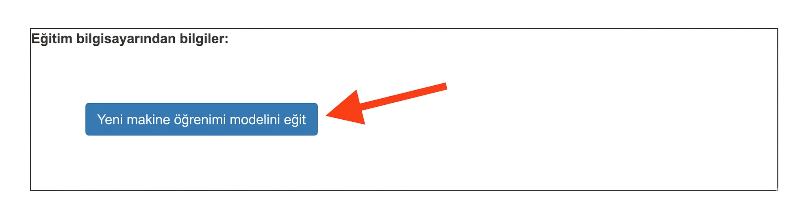
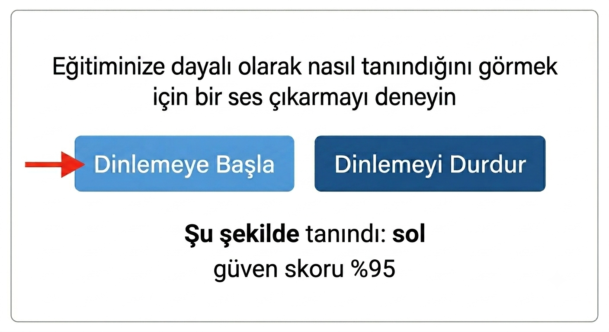

## Modeli eğitin

<html>

<iframe style="position: absolute; top: 0; left: 0; right: 0; width: 100%; height: 100%; border: none;" src="https://www.youtube.com/embed/7UVZ5Mqp1iY?rel=0&cc_load_policy=1" width="560" height="315" allowfullscreen allow="accelerometer; autoplay; clipboard-write; encrypted-media; gyroscope; picture-in-picture; web-share"></iframe>

</html>

İhtiyacınız olan örnekleri topladınız, şimdi bu örnekleri kullanarak makine öğrenimi modelinizi eğiteceksiniz.

\--- task ---

Sol üst köşedeki **< Projeye geri dön** seçeneğine tıklayın.

**Öğren ve Test Et** seçeneğine tıklayın.

**Yeni makine öğrenimi modeli eğit** etiketli butona tıklayın. Bu işlem birkaç dakika sürebilir.

\--- /task ---

Eğitim tamamlandıktan sonra, modelinizin sesli komutlarınızı ne kadar iyi tanıdığını test edebilirsiniz.

\--- task ---

**Dinlemeye başla** düğmesine tıklayın, ardından "sol" deyin.

\--- /task ---

Makine öğrenme modeliniz bunu tanırsa, ne söylediğinizi tahmin ederek ekranda gösterecektir.

\--- task ---

Modelin "yukarı", "aşağı" ve "sağ" yönlerini de tanıyıp tanımadığını test edin.

\--- /task ---

Modelin çalışma şeklinden memnun değilseniz, **Eğit** sayfasına geri dönün, daha fazla örnek ekleyin ve modelinizi tekrar eğitin.

