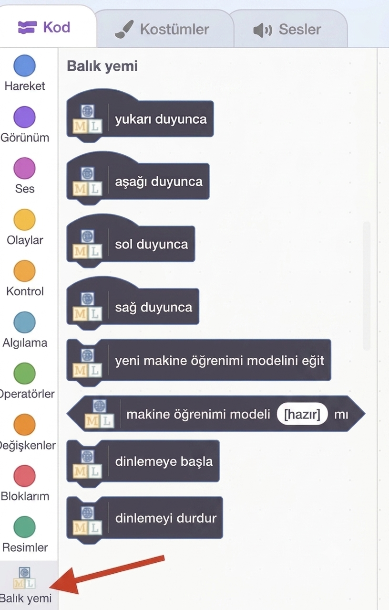
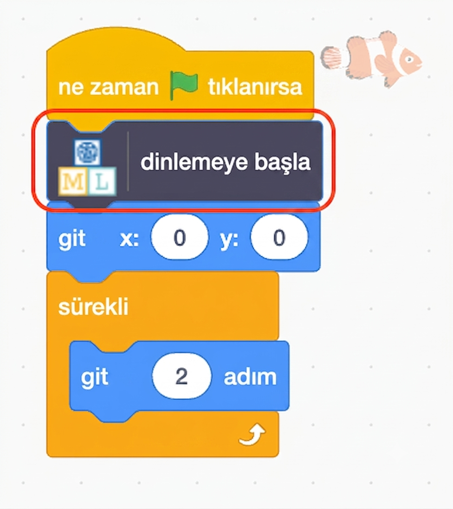
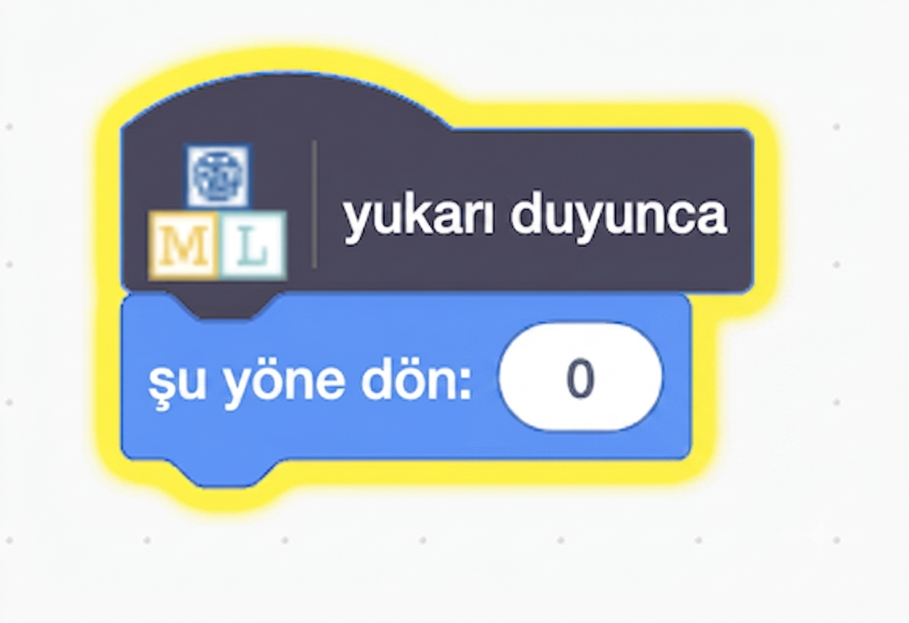
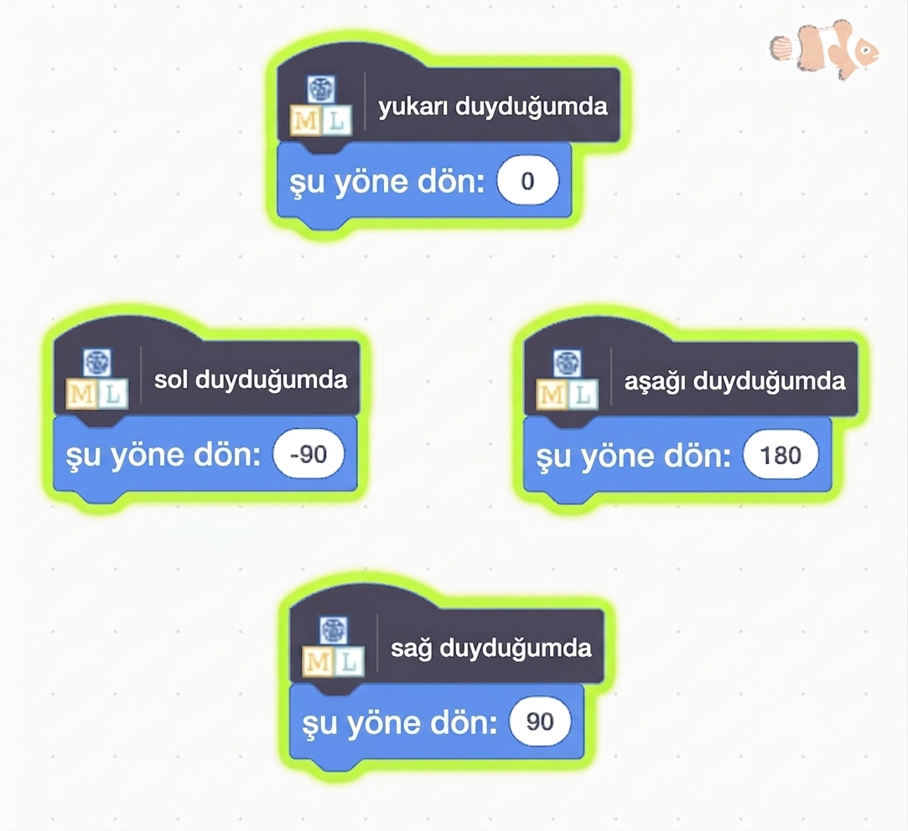

## Balığı hareket ettirin

<html>

<iframe style="position: absolute; top: 0; left: 0; right: 0; width: 100%; height: 100%; border: none;" src="https://www.youtube.com/embed/Gy54IjEGRTY?rel=0&cc_load_policy=1" width="560" height="315" allowfullscreen allow="accelerometer; autoplay; clipboard-write; encrypted-media; gyroscope; picture-in-picture; web-share"></iframe>

</html>

Modeliniz artık kelimeleri ayırt edebildiğine göre, onu bir Scratch programında kullanarak ekranda bir balığı hareket ettirebilirsiniz.

\--- task ---

**< Projeye geri dön** bağlantısına tıklayın.

**Oluştur** seçeneğine tıklayın.

**Scratch 3**'e tıklayın.

**Scratch 3'te Aç** seçeneğine tıklayın.

\--- /task ---

\--- task ---

En üstte bulunan **Proje şablonları**'na tıklayın ve içine önceden bazı kodlar eklenmiş olan balık görsellerini yüklemek için 'Balık yemi' projesini seçin.

\--- /task ---

Çocuklar için Makine Öğrenimi, yeni eğittiğiniz modeli kullanmanıza olanak sağlamak için Scratch'e bazı özel bloklar ekledi. Onları blok listesinin en altında bulabilirsiniz.

\--- task ---

**Balık** görselini seçtikten sonra **Kod** sekmesine tıklayın. Kodun doğru yerini bulun ve modele dinlemeye başlaması gerektiğini söyleyen özel bir blok ekleyin.

\--- /task ---

\--- task ---

**Balık** görseline 'yukarı' kodunu ekleyin.

\--- /task ---

\--- task ---

Balığı yukarı hareket ettirmek için kullandığınız koda bakın, ardından aşağı, sola ve sağa hareket ettirmek için gereken kodları bulmaya çalışın.

## --- collapse ---

## başlık: Bana nasıl yapılacağını göster

\--- /collapse ---

\--- /task ---

\--- task ---

**Yeşil bayrağa** tıklayın ve yukarı, aşağı, sol veya sağ deyin. Balığın beklediğiniz yönde hareket ettiğinden emin olun.

\--- /task ---

