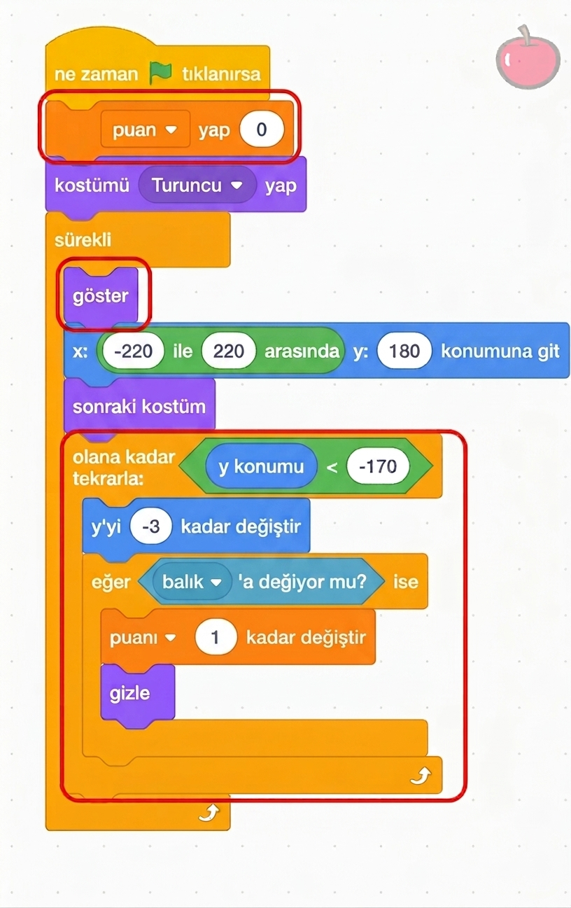

## Meydan Okuma

\--- challenge ---

\--- task ---

Puanı takip etmek için bir değişken ekleyin ve balık her yem yediğinde bir puan ekleyin.

## --- collapse ---

## başlık: Bana nasıl yapılacağını göster

Daire içine alınmış kodu **Yem** görseline ekleyin.

\--- /collapse ---

\--- /task ---

\--- task ---

Yiyecek olmayan yeni bir görsel ekleyin ve balık onu yerse puan düşürün.

\--- /task ---

\--- task ---

Yiyeceklerin farklı rastgele hızlarda düşmesini sağlayın.

\--- /task ---

\--- task ---

Ya da, isterseniz, karakteri ses komutlarıyla kontrol eden tamamen farklı bir oyun da yapabilirsiniz!

\--- /task ---

\--- /challenge ---
