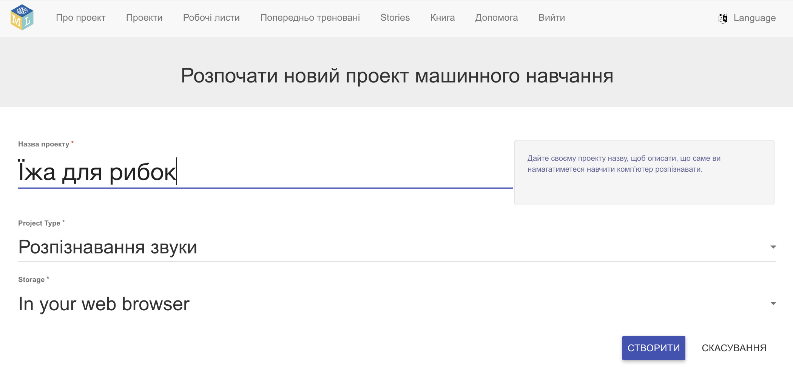
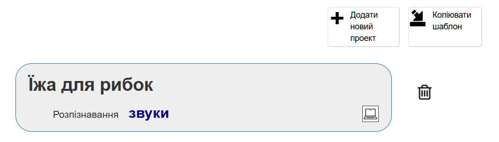
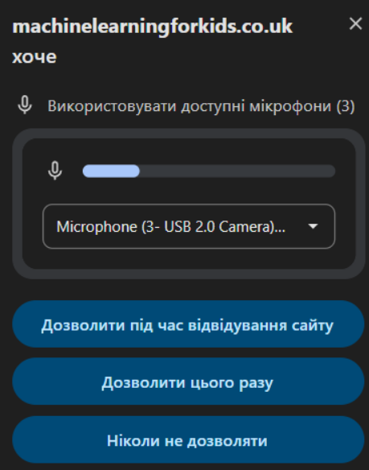

## Створи проєкт

<html>

<iframe style="position: absolute; top: 0; left: 0; right: 0; width: 100%; height: 100%; border: none;" src="https://www.youtube.com/embed/K7g-nLoMBTA?rel=0&cc_load_policy=1" width="560" height="315" allowfullscreen allow="accelerometer; autoplay; clipboard-write; encrypted-media; gyroscope; picture-in-picture; web-share"></iframe>

</html>

\--- task ---

Перейди на [machinelearningforkids.co.uk](https://machinelearningforkids.co.uk/#!/login){:target="_blank"} у браузері.

Натисни **Спробувати**.

\--- /task ---

\--- task ---

Натисни **Проєкти** на панелі меню угорі.

Натисни кнопку **+ Додати новий проєкт**.

Назви свій проєкт `Їжа для рибок` та налаштуй його на розпізнавання **звуків** та зберігання даних **у твоєму браузері**. Далі натисни кнопку **Створити**.

Тепер у списку проєктів має висвітлюватися «Їжа для рибок». Натисни на проєкт.

\--- /task ---

\--- task ---

Натисни кнопку **Навчити**.
![Головне меню проєкту зі стрілкою, що вказує на кнопку «Навчити»] (images/project-train.png)

Якщо побачиш вікно із запитом на використання мікрофону, натисни **Дозволити під час кожного відвідування**.

\--- /task ---

