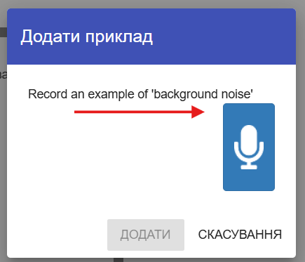
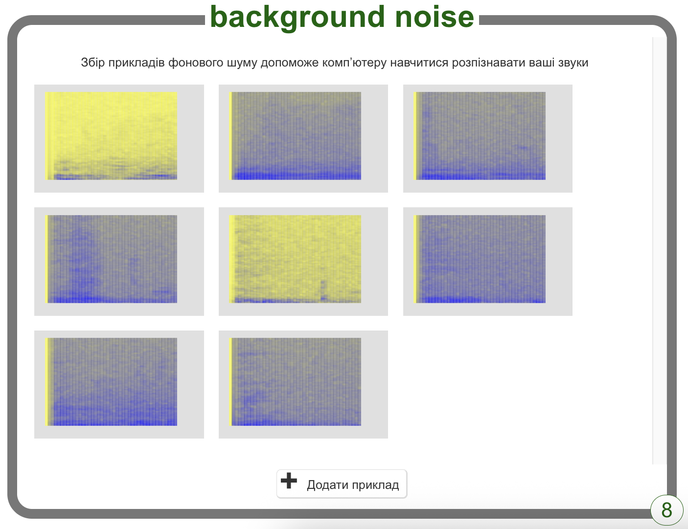

## Фоновий шум

<html>

<iframe style="position: absolute; top: 0; left: 0; right: 0; width: 100%; height: 100%; border: none;" src="https://www.youtube.com/embed/QQ7tSOlbyaY?rel=0&cc_load_policy=1" width="560" height="315" allowfullscreen allow="accelerometer; autoplay; clipboard-write; encrypted-media; gyroscope; picture-in-picture; web-share"></iframe>

</html>

Спочатку тобі потрібно записати зразки фонового шуму. Це допоможе твоїй моделі машинного навчання відрізнити голосові команди від фонового шуму.

--- task ---

Натисни кнопку **+ Додати приклад** у розділі **фоновий шум**.

Натисни на мікрофон, але при цьому нічого не говори, і запиши 2 секунди фонового шуму.

Натисни кнопку **Додати**, щоб зберегти запис.

--- /task ---

--- task ---

Повтори ці кроки, поки не запишеш **принаймні 8 зразків** фонового шуму.

--- /task ---
