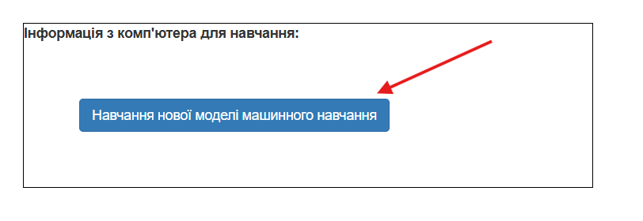
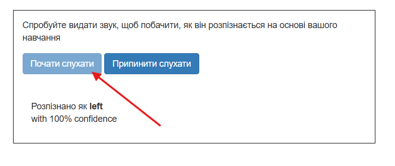

## Натренуй модель

<html>

<iframe style="position: absolute; top: 0; left: 0; right: 0; width: 100%; height: 100%; border: none;" src="https://www.youtube.com/embed/7UVZ5Mqp1iY?rel=0&cc_load_policy=1" width="560" height="315" allowfullscreen allow="accelerometer; autoplay; clipboard-write; encrypted-media; gyroscope; picture-in-picture; web-share"></iframe>

</html>

Необхідні зразки зібрано, тепер тобі треба їх використати, щоб натренувати свою модель машинного навчання.

--- task ---

Натисни **< Назад до проєкту** у верхньому лівому куті.

Натисни \*_Дізнатися та перевірити_.

Натисни кнопку **Навчання нової моделі машинного навчання**. Це може зайняти кілька хвилин.

--- /task ---

Після завершення навчання ти можеш перевірити, як добре твоя модель розпізнає голосові команди.

--- task ---

Натисни **Почати слухати**, і скажи «ліворуч».

--- /task ---

Якщо твоя модель машинного навчання розпізнає слово, то вона покаже свій прогноз щодо цього слова.

--- task ---

Також перевір, чи розпізнає модель слова «вгору», «вниз» та «праворуч».

--- /task ---

Якщо поведінка моделі не є задовільною, то повернись на сторінку **Навчити** і додай більше зразків, а потім знову натренуй свою модель.

