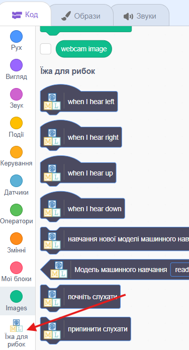
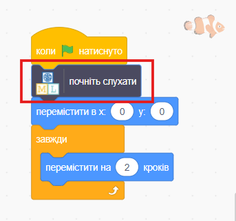
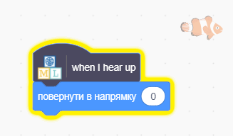
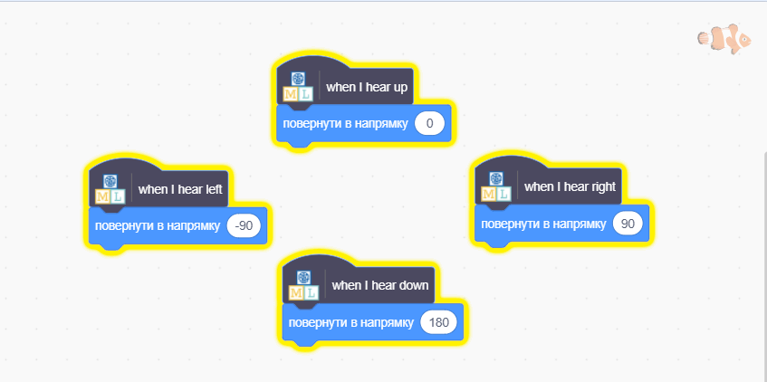

## Перемісти рибку

<html>

<iframe style="position: absolute; top: 0; left: 0; right: 0; width: 100%; height: 100%; border: none;" src="https://www.youtube.com/embed/Gy54IjEGRTY?rel=0&cc_load_policy=1" width="560" height="315" allowfullscreen allow="accelerometer; autoplay; clipboard-write; encrypted-media; gyroscope; picture-in-picture; web-share"></iframe>

</html>

Тепер, коли твоя модель може розрізняти команди, ти можеш використати її у програмі «Скретч», щоб пересувати рибку на екрані.

\--- task ---

Натисни **< Назад до проєкту**.

Натисни **Створити**.

Натисни **Scratch 3**.

Натисни **Відкрити в Scratch 3**.

\--- /task ---

\--- task ---

Натисни **Шаблони проєктів** угорі та вибери проєкт «Їжа для рибок», щоб завантажити спрайт рибки, до якого вже додано певний код.

\--- /task ---

Machine Learning for Kids додали до Скретчу деякі спеціальні блоки, які дозволяють використовувати щойно навчену модель. Знайди їх внизу списку з блоками.

\--- task ---

Обери спрайт **рибки** та натисни на вкладку **Код**. Знайди правильне місце у коді та додай спеціальний блок, щоби модель почала слухати.

\--- /task ---

\--- task ---

Додай код для вказівки «вгору» до спрайта **рибки**.

\--- /task ---

\--- task ---

Подивися на код, який потрібен для переміщення рибки вгору, а потім спробуй розібратися з кодом для переміщення вниз, вліво та вправо.

## --- collapse ---

## title: Як це зробити

\--- /collapse ---

\--- /task ---

\--- task ---

Натисни на **зелений прапорець** та промов «вгору», «вниз», «ліворуч» чи «праворуч». Перевір, чи рухається рибка у правильному напрямку.

\--- /task ---

