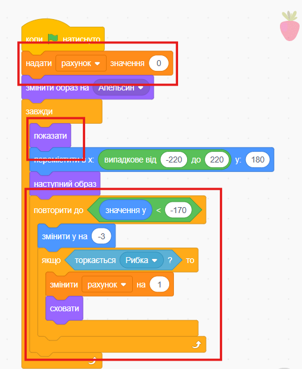

## Додаткове завдання

--- challenge ---

--- task ---

Додай змінну для відстеження рахунку і здобувай бал щоразу, коли рибка з'їдає корм.

--- collapse ---
---
title: Як це зробити
---

Додай виділений червоним код до спрайта **Їжа**.

--- /collapse ---

--- /task ---

--- task ---

Додай новий неїстівний спрайт, і віднімай очки, якщо рибка його їсть.

--- /task ---

--- task ---

Задай різну швидкість падіння їжі.

--- /task ---

--- task ---

Або якщо хочеш, створи зовсім іншу гру, яка використовує голосові команди для керування персонажем!

--- /task ---

--- /challenge ---
